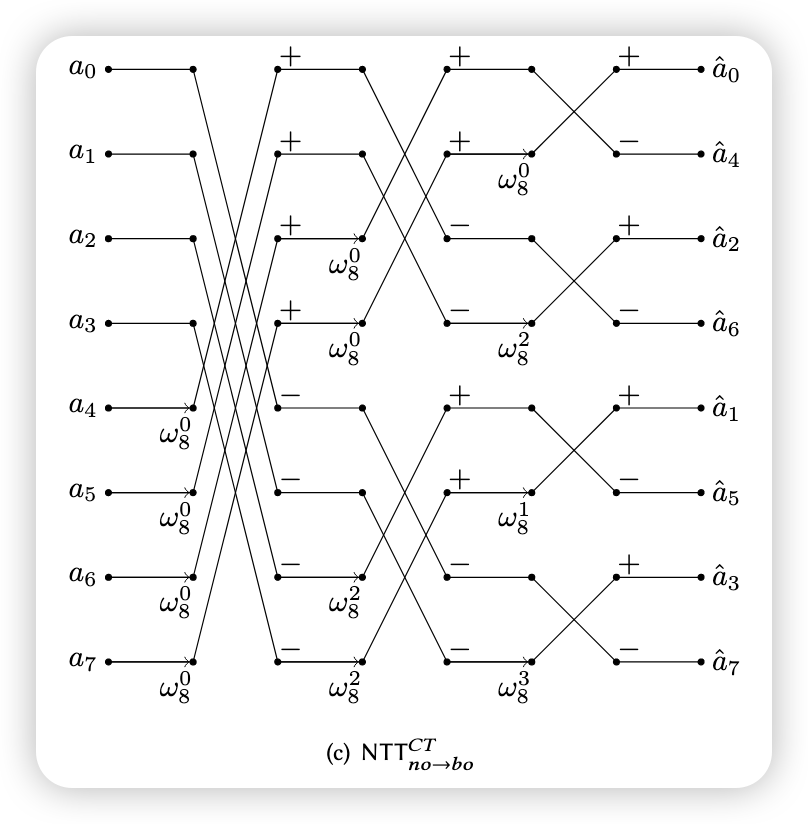

# [Definition] m项分圆环(cyclotomics)
$\xi_m=e^{\frac{2\pi i}{m}}$是m阶单位根，m阶分圆多项式$\Phi_m(x)=\Pi_{j\in Z_m^{\times}}(x-\xi^j_m)$,在$Z[x]$中是阶为$\phi(m)$的一次不可约多项式，其中$\phi$是欧拉函数。
三项分圆环(trinomial cyclotomic polynomial):
$\Phi_m(x)=x^n-x^{\frac{n}{2}}+1,m = 2^e3^l,e\geq 1,n = \phi(m)=\frac{m}{3}$
# [Definition] Primitive and principal root of unity
R be a commutative ring with multiplicative identity 1(含幺的交换环)
- the primitive k-th root of unity in R
$\psi^k = 1,\psi^i\neq 1,i=1,2,\cdots,k-1$
- the principal k-th root of unity in R
$\psi^k = 1, \Sigma_{j=0}^{k-1}\psi^{jl} = 0,l=1,2,\cdots,k-1$
# [Code]bitreversal
n be a power of two, and b be a non-negative integer satisfying b < n

# Polynomial Multiplication and Convolution
三种卷积下多项式乘积的NTT做法
### Convolution
#### Linear convolution
$\bold{c}=\bold{a}\cdot\bold{b}\in Z_q[x],\bold{c}=\Sigma_{i=0}^{2n-2}c_ix^i,c_k=\Sigma_{i+j=k}a_ib_j~mod~q,k=0,1,2,\cdots,2n-2$
若$\bold{c}=\bold{a}\cdot\bold{b}\in Z_q[x]/\phi(x)$,先计算$\bold{c'}=\bold{a}\cdot\bold{b}\in Z_q[x]$,再计算$c = c'~mod~\phi(x)$
#### Cyclic convolution
$\bold{c}=\bold{a}\cdot\bold{b}\in Z_q[x]/(x^n-1),\bold{c}=\Sigma_{i=0}^{n-1}c_ix^i,c_k=\Sigma_{i+j=k}a_ib_j+\Sigma_{i+j=k+n}a_ib_j~mod~q,k=0,1,2,\cdots,n-1$
#### Negative wrapped convolution
$\bold{c}=\bold{a}\cdot\bold{b}\in Z_q[x]/(x^n+1),\bold{c}=\Sigma_{i=0}^{n-1}c_ix^i,c_k=\Sigma_{i+j=k}a_ib_j-\Sigma_{i+j=k+n}a_ib_j~mod~q,k=0,1,2,\cdots,n-1$

### NUMBER THEORETIC TRANSFORM (NTT)
#### Cyclic Convolution-based NTT
*n-point CC-based NTT* has two parameters:
- the  length or the point $n$, where $n$ is a power of two
- and the modulus $q$,  and $q$ is a prime number
记 $w_n$ 是 the primitive n-th root of unity in $Zq$

*NTT:*
$\widehat{a}_j=\Sigma_{i=0}^{n-1}a_iw^{ij},j=0,1,2,\cdots,n-1$
即：
$$\begin{bmatrix} \widehat{a_0} \\ \widehat{a_1} \\ \cdots \\ \widehat{a_{n-1}} \end{bmatrix}=\begin{bmatrix} 1 & w_n^{0*1} & w_n^{0*2} & \cdots & w_n^{0*(n-1)}  \\ 1 & w_n^{1*1} & w_n^{1*2} & \cdots & w_n^{1*(n-1)} \\ \cdots & \cdots & \cdots & \cdots & \cdots \\ 1 & w_n^{(n-1)*1} & w_n^{(n-1)*2} & \cdots & w_n^{(n-1)*(n-1)} \end{bmatrix}\begin{bmatrix} a_0 \\ a_1\\ \cdots \\ a_{n-1}\end{bmatrix}$$

*INTT:*
$a_i=n^{-1}\Sigma_{j=0}^{n-1}\widehat{a}_jw_n^{-ij},i=0,1,2,\cdots,n-1$
$$\begin{bmatrix} a_0 \\ a_1\\ \cdots \\ a_{n-1}\end{bmatrix}=n^{-1}\begin{bmatrix} 1 & w_n^{-0*1} & w_n^{-0*2} & \cdots & w_n^{-0*(n-1)}  \\ 1 & w_n^{-1*1} & w_n^{-1*2} & \cdots & w_n^{-1*(n-1)} \\ \cdots & \cdots & \cdots & \cdots & \cdots \\ 1 & w_n^{-(n-1)*1} & w_n^{-(n-1)*2} & \cdots & w_n^{-(n-1)*(n-1)} \end{bmatrix}\begin{bmatrix} \widehat{a_0} \\ \widehat{a_1} \\ \cdots \\ \widehat{a_{n-1}} \end{bmatrix}$$
#### Negative Wrapped Convolution-based NTT
- the modulus q 
- $\psi_{2n}$ is the primitive 2n-th root of unity in Zq
- $w_n = \psi_{2n}^2~mod~q$ 
- 记$\bold{\psi}=(1,\psi_{2n},\psi_{2n}^2,\cdots,\psi_{2n}^{n-1}),\bold{\psi}^{-1}=(1,\psi_{2n}^{-1},\psi_{2n}^{-2},\cdots,\psi_{2n}^{-(n-1)})$

*$NTT^{\psi}$:*
$\bold{\widehat{a}} = NTT^{\psi}(\bold{a})=NTT(\bold{\psi}\circ\bold{a})$
$\widehat{a}_j=\Sigma_{i=0}^{n-1}a_i\psi_{2n}^iw_n^{ij},j=0,1,2,\cdots,n-1$
即：
$$\begin{bmatrix} \widehat{a_0} \\ \widehat{a_1} \\ \cdots \\ \widehat{a_{n-1}} \end{bmatrix}=\begin{bmatrix} 1 &0 & 0 & \cdots & 0 \\ 0 & \psi_{2n}^1 & 0 & \cdots & 0 \\ 0 & 0 & \psi_{2n}^2 & \cdots & 0 \\ \cdots & \cdots & \cdots & \cdots & \cdots\\ 0 &0 & 0 & \cdots & \psi_{2n}^{n-1}\end{bmatrix}\begin{bmatrix} 1 & w_n^{0*1} & w_n^{0*2} & \cdots & w_n^{0*(n-1)}  \\ 1 & w_n^{1*1} & w_n^{1*2} & \cdots & w_n^{1*(n-1)} \\ \cdots & \cdots & \cdots & \cdots & \cdots \\ 1 & w_n^{(n-1)*1} & w_n^{(n-1)*2} & \cdots & w_n^{(n-1)*(n-1)} \end{bmatrix}\begin{bmatrix} a_0 \\ a_1\\ \cdots \\ a_{n-1}\end{bmatrix}$$

*$INTT^{\psi}$:*
$\bold{a}=NTT^{-\psi}(\bold{\widehat{a}})=\bold{\psi}^{-1}\circ NTT^{-1}(\bold{\widehat{a}})$
$a_i=n^{-1}\psi_{2n}^{-i}\Sigma_{j=0}^{n-1}\widehat{a}_jw_n^{-ij},i=0,1,2,\cdots,n-1$
$$\begin{bmatrix} a_0 \\ a_1\\ \cdots \\ a_{n-1}\end{bmatrix}=n^{-1}\psi_{2n}^{-i}\begin{bmatrix} 1 & w_n^{-0*1} & w_n^{-0*2} & \cdots & w_n^{-0*(n-1)}  \\ 1 & w_n^{-1*1} & w_n^{-1*2} & \cdots & w_n^{-1*(n-1)} \\ \cdots & \cdots & \cdots & \cdots & \cdots \\ 1 & w_n^{-(n-1)*1} & w_n^{-(n-1)*2} & \cdots & w_n^{-(n-1)*(n-1)} \end{bmatrix}\begin{bmatrix} \widehat{a_0} \\ \widehat{a_1} \\ \cdots \\ \widehat{a_{n-1}} \end{bmatrix}$$
### NTT-based Polynomial Multiplication
#### Linear convolution-based polynomial multiplication
*Step1:*
pad them to the length of 2n with zeros, $a' = (a_0,\cdots, a_{n−1}, 0,\cdots , 0), b' = (b_0,\cdots , b_{n−1}, 0,\cdots, 0)$
*Step2:*
use 2n-point NTT/INTT for $\bold{c} = INTT(NTT(\bold{a'})\circ NTT(\bold{b'}))$

#### Cyclic convolution-based polynomial multiplication
$\bold{c} = INTT(NTT(\bold{a})\circ NTT(\bold{b}))$
#### Negative wrapped convolution-based polynomial multiplication
$\bold{c} = INTT^{\psi^{-1}}(NTT^{\psi}(\bold{a})\circ NTT^{\psi}(\bold{b}))$

$\begin{bmatrix} 1 & w_n^{0*1} & w_n^{0*2} & \cdots & w_n^{0*(n-1)}  \\ 1 & w_n^{0*1} & w_n^{0*2} & \cdots & w_n^{0*(n-1)} \\ 1 & w_n^{0*1} & w_n^{0*2} & \cdots & w_n^{0*(n-1)} \\ 1 & w_n^{0*1} & w_n^{0*2} & \cdots & w_n^{0*(n-1)} \end{bmatrix}$

> the complexity of NTT-based multiplication without fast algorithms is $O(n^2)$.

# [Theorem] Chinese Remainder Theorem in ring form

# FFT trick

Cooley-Tukey butterfly:
$a_i' = a_i + w*a_{i+m}$
$a_i''= a_i - w*a_{i+m}$

Gentlemen-Sande butterfly:
$a_i = \frac{a_i'+a_i''}{2}$
$a_{i+m} = \frac{a_i'-a_i''}{2w}$

# $FFT~ Trick~ for~ CC-based ~NTT~ over~ Z_q [x]/(x_n − 1)$
$Z_q[x]/(x^n-1)\cong \Pi_{i=0}^{n-1}Z_q[x]/(x-w_n^{brv_n(i)})$

| i      | 0   | 1   | 2   | 3   | 4   | 5   | 6   | 7   |
| ------ | --- | --- | --- | --- | --- | --- | --- | --- |
| 二进制 | 000 | 001 | 010 | 011 | 100 | 101 | 110 | 111 |
|  $brv_n(i)$   | 0|  4   |  2   |  6   |  1   |   5  |   3  |   7  |

| NTT | INTT |
| --- | ---- |
|     |      |

|     |     |
| --- | --- |
|     |      |

# $FFT ~Trick ~for ~NWC-based ~NTT~ over~ Z_q [x]/(x_n + 1)$
