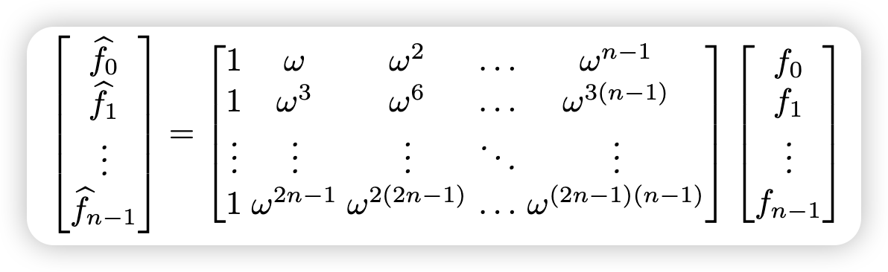

[TOC]
## Contribution
## main idea
## preliminaries
### Primitive and principal root of unity
R be a commutative ring with multiplicative identity 1(含幺的交换环)
- the primitive k-th root of unity in R
$\psi^k = 1,\psi^i\neq 1,i=1,2,\cdots,k-1$
- the principal k-th root of unity in R
$\psi^k = 1, \Sigma_{j=0}^{k-1}\psi^{jl} = 0,l=1,2,\cdots,k-1$
### Polynomial Multiplication and Convolution
三种卷积
#### Convolution
##### Linear convolution
$\bold{c}=\bold{a}\cdot\bold{b}\in Z_q[x],\bold{c}=\Sigma_{i=0}^{2n-2}c_ix^i,c_k=\Sigma_{i+j=k}a_ib_j~mod~q,k=0,1,2,\cdots,2n-2$
若$\bold{c}=\bold{a}\cdot\bold{b}\in Z_q[x]/\phi(x)$,先计算$\bold{c'}=\bold{a}\cdot\bold{b}\in Z_q[x]$,再计算$c = c'~mod~\phi(x)$
##### Cyclic convolution
$\bold{c}=\bold{a}\cdot\bold{b}\in Z_q[x]/(x^n-1),\bold{c}=\Sigma_{i=0}^{n-1}c_ix^i,c_k=\Sigma_{i+j=k}a_ib_j+\Sigma_{i+j=k+n}a_ib_j~mod~q,k=0,1,2,\cdots,n-1$
##### Negative wrapped convolution
$\bold{c}=\bold{a}\cdot\bold{b}\in Z_q[x]/(x^n+1),\bold{c}=\Sigma_{i=0}^{n-1}c_ix^i,c_k=\Sigma_{i+j=k}a_ib_j-\Sigma_{i+j=k+n}a_ib_j~mod~q,k=0,1,2,\cdots,n-1$
## techniques
### NUMBER THEORETIC TRANSFORM (NTT)
#### Cyclic Convolution-based NTT
*n-point CC-based NTT* has two parameters:
- the  length or the point $n$, where $n$ is a power of two
- and the modulus $q$,  and $q$ is a prime number
记 $w_n$ 是 the primitive n-th root of unity in $Zq$

*NTT:*
$\widehat{a}_j=\Sigma_{i=0}^{n-1}a_iw^{ij},j=0,1,2,\cdots,n-1$
即：
$$\begin{bmatrix} \widehat{a_0} \\ \widehat{a_1} \\ \cdots \\ \widehat{a_{n-1}} \end{bmatrix}=\begin{bmatrix} 1 & w_n^{0*1} & w_n^{0*2} & \cdots & w_n^{0*(n-1)}  \\ 1 & w_n^{1*1} & w_n^{1*2} & \cdots & w_n^{1*(n-1)} \\ \cdots & \cdots & \cdots & \cdots & \cdots \\ 1 & w_n^{(n-1)*1} & w_n^{(n-1)*2} & \cdots & w_n^{(n-1)*(n-1)} \end{bmatrix}\begin{bmatrix} a_0 \\ a_1\\ \cdots \\ a_{n-1}\end{bmatrix}$$

*INTT:*
$a_i=n^{-1}\Sigma_{j=0}^{n-1}\widehat{a}_jw_n^{-ij},i=0,1,2,\cdots,n-1$
$$\begin{bmatrix} a_0 \\ a_1\\ \cdots \\ a_{n-1}\end{bmatrix}=n^{-1}\begin{bmatrix} 1 & w_n^{-0*1} & w_n^{-0*2} & \cdots & w_n^{-0*(n-1)}  \\ 1 & w_n^{-1*1} & w_n^{-1*2} & \cdots & w_n^{-1*(n-1)} \\ \cdots & \cdots & \cdots & \cdots & \cdots \\ 1 & w_n^{-(n-1)*1} & w_n^{-(n-1)*2} & \cdots & w_n^{-(n-1)*(n-1)} \end{bmatrix}\begin{bmatrix} \widehat{a_0} \\ \widehat{a_1} \\ \cdots \\ \widehat{a_{n-1}} \end{bmatrix}$$
#### Negative Wrapped Convolution-based NTT
- the modulus q 
- $\psi_{2n}$ is the primitive 2n-th root of unity in Zq
- $w_n = \psi_{2n}^2~mod~q$ 
- 记$\bold{\psi}=(1,\psi_{2n},\psi_{2n}^2,\cdots,\psi_{2n}^{n-1}),\bold{\psi}^{-1}=(1,\psi_{2n}^{-1},\psi_{2n}^{-2},\cdots,\psi_{2n}^{-(n-1)})$

*$NTT^{\psi}$:*
$\bold{\widehat{a}} = NTT^{\psi}(\bold{a})=NTT(\bold{\psi}\circ\bold{a})$
$\widehat{a}_j=\Sigma_{i=0}^{n-1}a_i\psi_{2n}^iw_n^{ij},j=0,1,2,\cdots,n-1$
即：
$$\begin{bmatrix} \widehat{a_0} \\ \widehat{a_1} \\ \cdots \\ \widehat{a_{n-1}} \end{bmatrix}=\begin{bmatrix} 1 &0 & 0 & \cdots & 0 \\ 0 & \psi_{2n}^1 & 0 & \cdots & 0 \\ 0 & 0 & \psi_{2n}^2 & \cdots & 0 \\ \cdots & \cdots & \cdots & \cdots & \cdots\\ 0 &0 & 0 & \cdots & \psi_{2n}^{n-1}\end{bmatrix}\begin{bmatrix} 1 & w_n^{0*1} & w_n^{0*2} & \cdots & w_n^{0*(n-1)}  \\ 1 & w_n^{1*1} & w_n^{1*2} & \cdots & w_n^{1*(n-1)} \\ \cdots & \cdots & \cdots & \cdots & \cdots \\ 1 & w_n^{(n-1)*1} & w_n^{(n-1)*2} & \cdots & w_n^{(n-1)*(n-1)} \end{bmatrix}\begin{bmatrix} a_0 \\ a_1\\ \cdots \\ a_{n-1}\end{bmatrix}$$

*$INTT^{\psi}$:*
$\bold{a}=NTT^{-\psi}(\bold{\widehat{a}})=\bold{\psi}^{-1}\circ NTT^{-1}(\bold{\widehat{a}})$
$a_i=n^{-1}\psi_{2n}^{-i}\Sigma_{j=0}^{n-1}\widehat{a}_jw_n^{-ij},i=0,1,2,\cdots,n-1$
$$\begin{bmatrix} a_0 \\ a_1\\ \cdots \\ a_{n-1}\end{bmatrix}=n^{-1}\psi_{2n}^{-i}\begin{bmatrix} 1 & w_n^{-0*1} & w_n^{-0*2} & \cdots & w_n^{-0*(n-1)}  \\ 1 & w_n^{-1*1} & w_n^{-1*2} & \cdots & w_n^{-1*(n-1)} \\ \cdots & \cdots & \cdots & \cdots & \cdots \\ 1 & w_n^{-(n-1)*1} & w_n^{-(n-1)*2} & \cdots & w_n^{-(n-1)*(n-1)} \end{bmatrix}\begin{bmatrix} \widehat{a_0} \\ \widehat{a_1} \\ \cdots \\ \widehat{a_{n-1}} \end{bmatrix}$$
#### NTT-based Polynomial Multiplication
##### Linear convolution-based polynomial multiplication
*Step1:*
pad them to the length of 2n with zeros, $a' = (a_0,\cdots, a_{n−1}, 0,\cdots , 0), b' = (b_0,\cdots , b_{n−1}, 0,\cdots, 0)$
*Step2:*
use 2n-point NTT/INTT for $\bold{c} = INTT(NTT(\bold{a'})\circ NTT(\bold{b'}))$

##### Cyclic convolution-based polynomial multiplication
$\bold{c} = INTT(NTT(\bold{a})\circ NTT(\bold{b}))$
##### Negative wrapped convolution-based polynomial multiplication
$\bold{c} = INTT^{\psi^{-1}}(NTT^{\psi}(\bold{a})\circ NTT^{\psi}(\bold{b}))$

$\begin{bmatrix} 1 & w_n^{0*1} & w_n^{0*2} & \cdots & w_n^{0*(n-1)}  \\ 1 & w_n^{0*1} & w_n^{0*2} & \cdots & w_n^{0*(n-1)} \\ 1 & w_n^{0*1} & w_n^{0*2} & \cdots & w_n^{0*(n-1)} \\ 1 & w_n^{0*1} & w_n^{0*2} & \cdots & w_n^{0*(n-1)} \end{bmatrix}$

> the complexity of NTT-based multiplication without fast algorithms is $O(n^2)$.

### BASIC RADIX-2 FAST NUMBER THEORETIC TRANSFORM

### NTT(Number Theoretic Transform)
$R_q = Z_q[x]/(x^n+1),n是2的指数幂,q是素数，且2n|(q-1),w是Z_q中阶为2n的根,即w^{2n} = 1, \gamma = w^2~mod~q$
$给定f,g\in R_q,计算 h= fg \in R_q$
*步骤如下：*
*Step1:* 计算$\tilde{f},\tilde{g}$
$\tilde{f} = (1,w,w^2,\cdots,w^{n-1})\circ f,\tilde{g} = (1,w,w^2,\cdots,w^{n-1})\circ g$
*Step2:* 计算$\tilde{h}=NTT^{-1}(NTT(\tilde{f})\circ NTT(\tilde{g}))$
    *Step2.1:* 计算正向NTT
$\hat{f}=NTT(\tilde{f}) = \Sigma_{i=0}^{n-1}\tilde{f_i}\gamma^{ij}~mod~q,i=0,1,\cdots,n-1$
    *Step2.2:* 计算点乘 $\circ$
    *Step2.3:* 计算反向NTT
    $\tilde{f}=NTT^{-1}(\hat{f})$
    $\tilde{f_i} = n^{-1}\Sigma_{j=0}^{n-1}\hat{f_j}\gamma^{-ij}~mod~q,i=0,1,\cdots,n-1$
*Step3:* 计算$h = (1,w^{-1},w^{-2},\cdots,w^{-(n-1)})\circ \tilde{h}$
$\widehat{NTT}(f)=NTT((1,w,w^2,\cdots,w^{n-1})\circ f)$
$\widehat{NTT}^{-1}(\hat{f})=(1,w^{-1},w^{-2},\cdots,w^{-(n-1)})\circ NTT^{-1}(\hat{f})$
$h=\widehat{NTT}^{-1}(\widehat{NTT}(f)\circ \widehat{NTT}(g))$
*使用中国剩余定理CRT来计算NTT:*

*例子：*
$Z_{17}[x]/(x^4+1)$，计算$ntt(g),g=1+4x+2x^2+13x^3$
$n = 4, q = 17, w = 2$
$\begin{bmatrix} 1 & 2 & 4 & 8 \\ 1 & 8 & 64 & 512 \\ 1 & 32 & 1024 & 32768 \\ 1 & 128 & 16384 & 2097152\end{bmatrix}$$\begin{bmatrix} 1  \\ 4  \\ 2 \\ 13\end{bmatrix}$=$\begin{bmatrix} 2  \\ 0  \\ 16 \\ 3\end{bmatrix}$

# Pt-NTT
$R_q = Z_q[x]/(x^n+1),n是2的指数幂,q是素数，\alpha是非负整数,且\frac{n}{2^{\alpha-1}}|(q-1),w是Z_q中阶为2n的根,即w^{2n} = 1, \gamma = w^2~mod~q$
*Step1:*$对f,g做\alpha分解$
$f = \Sigma_{i=0}^{2^{\alpha}-1}x^i\tilde{f_i}(x^{2^\alpha})$,$g = \Sigma_{j=0}^{2^{\alpha}-1}x^j\tilde{g_j}(x^{2^\alpha})$
*Step2:*$计算\tilde{h_i}(z),i=0,1,\cdots,2^\alpha-1,记z = x^{2^\alpha}$
$$\tilde{h_i}(z)=\Sigma_{l=0}^i\tilde{f_l}(z)\tilde{g}_{i-l}(z)+\Sigma_{l=i+1}^{2^\alpha-1}z\tilde{f_l}(z)\tilde{g}_{2^\alpha+i-l}(z)\\=\widehat{NTT}^{-1}(\Sigma_{l=0}^i\widehat{NTT}(\tilde{f_l}(z))\circ\widehat{NTT}(\tilde{g}_{i-l}(z))+\Sigma_{l=i+1}^{2^\alpha-1}\widehat{NTT}(z)\widehat{NTT}(\tilde{f_l}(z))\circ\widehat{NTT}(\tilde{g}_{2^\alpha+i-l}(z)))$$
*可以使用Karatsuba技巧化简*
*Step3:*$计算h(x)=\Sigma_{i=0}^{2^\alpha-1}x^i\tilde{h_i}(x^{2^\alpha})$
- Pt-NTT和T-NTT
Pt-NTT是从上做$\alpha$分解，T-NTT是从下做$\beta$分解,他们在计算上是等效的

#TODO
1. T-NTT的详细计算过程
2. T-NTT与Pt-NTT的关系证明

# H-NTT(Hybrid Number Theoretic Transform)
$H(n,\alpha,\beta),R_q = Z_q[x]/(x^n+1),n是2的指数幂,q是素数，且\frac{n}{2^{\alpha+\beta-1}}|(q-1),w是Z_q中阶为2n的根,即w^{2n} = 1, \gamma = w^2~mod~q$
*Step1:*$对f,g做\alpha分解$
$f = \Sigma_{i=0}^{2^{\alpha}-1}x^i\tilde{f_i}(x^{2^\alpha})$,$g = \Sigma_{j=0}^{2^{\alpha}-1}x^j\tilde{g_j}(x^{2^\alpha})$
*Step2:*$计算\tilde{h_i}(z),i=0,1,\cdots,2^\alpha-1,记z = x^{2^\alpha}$
$$\tilde{h_i}(z)=\Sigma_{l=0}^i\tilde{f_l}(z)\tilde{g}_{i-l}(z)+\Sigma_{l=i+1}^{2^\alpha-1}z\tilde{f_l}(z)\tilde{g}_{2^\alpha+i-l}(z)\\=T-NTT^{-1}(\Sigma_{l=0}^iT-NTT(\tilde{f_l}(z))\circ T-NTT(\tilde{g}_{i-l}(z))+\Sigma_{l=i+1}^{2^\alpha-1}T-NTT(z)T-NTT(\tilde{f_l}(z))\circ T-NTT(\tilde{g}_{2^\alpha+i-l}(z)))$$
*可以使用Karatsuba技巧化简*
*Step3:*$计算h(x)=\Sigma_{i=0}^{2^\alpha-1}x^i\tilde{h_i}(x^{2^\alpha})$

## code
## conclusion