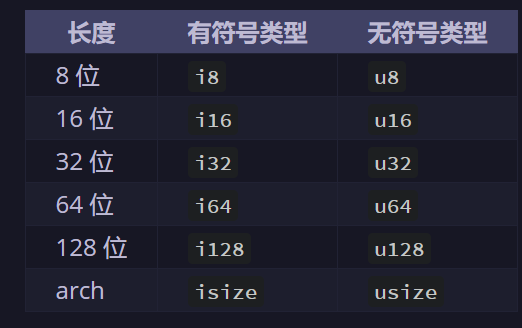
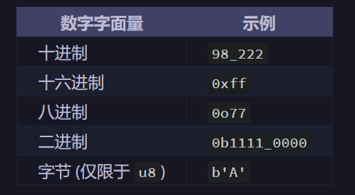

# 通用编程概念
## 本章重点
1. 如何创建变量和常量
2. rust有哪些数据类型
3. rust如何创建函数
4. rust如何实现控制流

[TOC]

## 3.1 变量和可变性
### 3.1.1 创建变量
Rust默认情况下变量**不可变**,使用```let```创建变量
```rust
fn main(){
    let x = 5;
}
```
若给不可变变量二次赋值，会报错
```rust
fn main()(
    let x = 5;
    println!("The value of x is {}",x);
    x = 6;
    println!("The value of x is {}",x);
)
```
运行得到：
```rust
$ cargo run
   Compiling variables v0.1.0 (file:///projects/variables)
error[E0384]: cannot assign twice to immutable variable `x`
 --> src/main.rs:4:5
  |
2 |     let x = 5;
  |         -
  |         |
  |         first assignment to `x`
  |         help: consider making this binding mutable: `mut x`
3 |     println!("The value of x is: {}", x);
4 |     x = 6;
  |     ^^^^^ cannot assign twice to immutable variable

For more information about this error, try `rustc --explain E0384`.
error: could not compile `variables` due to previous error
```
要使变量**可变**，使用```let mut```
```rust
fn main(){
    let mut x = 5;
    println!("The value of x is {}",x);
    x = 6;
    println!("The value of x is {}",x);
}
```
运行得到：
```rust
$ cargo run
   Compiling variables v0.1.0 (file:///projects/variables)
    Finished dev [unoptimized + debuginfo] target(s) in 0.30s
     Running `target/debug/variables`
The value of x is: 5
The value of x is: 6
```
### 3.1.2 创建常量
使用```const```创建常量：常量是一个绑定到一个常数名且不允许更改的值，常量可以**在任意作用域内**声明，包括全局作用域。常量只能设置为**常量表达式**或是只能**在运行时计算得到**的值，不能是函数调用的结果
```rust
fn main() {
const THREE_HOURS_IN_SECONDS: u32 = 60 * 60 * 3;
}
```
Rust 常量的命名约定是全部字母都使用大写，并使用下划线分隔单词。
### 3.1.3 遮蔽
可以声明和前面变量具有相同名称的新变量，第一个变量会被第二个变量遮蔽。我们可以通过使用相同的变量名并重复使用```let```遮蔽变量
```rust
fn main(){
    let x = 5;

    let x = x + 1;

    {
        let x = x * 2;
        println!("The value of x in the inner scope is: {}", x); 
    }
    println!("The value of x is: {}", x);
}
```
运行得到：
```rust
$ cargo run
   Compiling variables v0.1.0 (file:///projects/variables)
    Finished dev [unoptimized + debuginfo] target(s) in 0.31s
     Running `target/debug/variables`
The value of x in the inner scope is: 12
The value of x is: 6
```
遮蔽与```mut``之间的一个区别：
遮蔽前后的变量类型可以改变，mut不可以
## 3.2 数据类型
rust的每个值都有确切的数据类型。rust作为一种**静态类型**的语言，必须在编译期知道所有变量的类型。编译器通常可以根据值和使用方式推导出我们想要使用的类型。若类型可能是多种情况时，我们必须加上一个**类型标注**。
### 3.2.1 标量类型
**标量**(scalar)类型表示单个值，rust有4个基本的标量类型：**整型、浮点型、布尔型和字符**
#### 整数类型
{width="50%" height="50%"}
* 有符号数字以二进制补码形式存储
* 有符号类型数字范围为$-2^{n-1}$ ~ $2^{n-1}-1$,无符号类型数字范围为$0$ ~ $2^n-1$
* ```isize```和```usize```取决于程序运行的计算机体系结构
Rust的整型字面量
{width="50%" height="50%"}
> 整型溢出：
> * 在调试(debug)模式，Rust会检查整型溢出，若存在问题编译时会panic
> * 在release模式：Rust会进行二进制补码包裹的操作
> 
> 要显式处理溢出的可能性，可以使用标准库针对原始数字类型提供的以下一系列方法：
1. 使用 ```wrapping_*``` 方法在所有模式下进行包裹，例如 ```wrapping_add```
2. 如果使用 ```checked_*``` 方法时发生溢出，则返回 None 值
3. 使用 ```overflowing_*``` 方法返回该值和一个指示是否存在溢出的布尔值
4. 使用 ```saturating_*``` 方法使值达到最小值或最大值
#### 浮点类型
Rust中的浮点型是```f32```和```f64```,默认浮点类型是```f64```
```rust
fn main() {
    let x = 2.0; // f64

    let y: f32 = 3.0; // f32
}
```
#### 数字运算
Rust支持基本数学运算：其中整数除法会向下取整
```rust
fn main() {
    // addition
    let sum = 5 + 10;

    // subtraction
    let difference = 95.5 - 4.3;

    // multiplication
    let product = 4 * 30;

    // division
    let quotient = 56.7 / 32.2;
    let floored = 2 / 3; // Results in 0

    // remainder
    let remainder = 43 % 5;
}
```
#### 布尔类型
Rust 中的布尔类型也有两个可能的值：true 和 false。布尔值的大小为 1 个字节。Rust 中的布尔类型使用 bool 声明。
```rust
fn main() {
    let t = true;

    let f: bool = false; // with explicit type annotation
}
```
#### 字符类型
* Rust的```char```类型采用单引号，字符串字面量使用双引号。
* 字符类型大小为4个字节
* 表示一个**Unicode**标量值，表示的内容不止ASCII：包括中文/日文/韩文、emoji、零宽空格
```rust
fn main() {
    let c = 'z';
    let z = 'ℤ';
    let heart_eyed_cat = '😻';
}
```
### 3.2.2 复合类型
复合类型(compound type)可以将多个值组合成一个类型。Rust有两种基本的复合类型：**元组(tuple)**、**数组(array)**
#### 元组类型
元组将多种类型的多个值组合到一个复合的类型中，**元组长度是固定的**，声明后就无法增长和或缩小
```rust
fn main(){
    let tup: (i32, f64, u8) = (500, 6.4, 1);
}  
```
想从元组中获得个别值，有两种方法：
1. 模式匹配结构
```rust
fn main(){
    let tup: (i32, f64, u8) = (500, 6.4, 1);

    let (x, y, z) = tup;

    println!("The value of y is {}", y);
}
```
2. 使用索引访问
```rust
fn main(){
    let x: (i32, f64, u8) = (500, 6.4, 1);

    let five_hundred = x.0;

    let six_point_four = x.1;

    let one = x.2;
}  
```

没有任何值的元组()是一种特殊的类型，称为单元类型，只有一个值称为单元值，写成()

#### 数组类型
数组的每个元素必须具有**相同的类型**，Rust中的数组**具有固定长度**
1. 初始化数组
```rust
fn main(){
    let a = [1, 2, 3, 4, 5];

    
#![allow(unused)]
fn main() {
let months = ["January", "February", "March", "April", "May", "June", "July",
              "August", "September", "October", "November", "December"];
}

let a: [i32; 5] = [1, 2, 3, 4, 5];

let b = [3; 5]; // a=[3, 3, 3, 3, 3]
}
```
2. 访问数组元素
通过索引访问
```rust
fn main(){
    let a = [1, 2, 3, 4, 5];

    let first = a[0];

    let second = a[1];
}
```
若访问超出数组范围，rust会panic

## 3.3 函数
### 创建函数
```rust
fn main(){
    println!("Hello World!");

    another_funtion();

    print_labeled_measurement(5, 'h');
}

fn another_funtion(){
    println!("Another funtion.");
}

fn print_labeled_measurement(value: i32, unit_label: char){
    println!("The measurement is: {}{}", value, unit_label);
}
```
1. 函数名
* ```main```函数是很多程序的入口点
* ```fn```用来声明新函数，后跟函数名和一对圆括号
* 函数命名使用下划线命名法，所有字母都是小写且使用下划线分割单词
* 注意，源码中```another_function``` 定义在 ```main``` 函数之后；也可以定义在之前。Rust 不关心函数定义于何处，只要定义了就行。

2. 参数
在函数签名中，必须声明每个参数的类型。当一个函数有多个参数时，使用逗号分隔.
### 语句与表达式
函数体由一系列语句组成，也可选择以表达式结尾。语句是执行一些操作但不返回值的指令；表达式计算并产生一个值，表达式可以是语句的一部分。
```rust
fn main(){
    let y = {
        let x = 3;
        x + 1
    };

    println!("The value of y is {}", y);
}
```
### 带有返回值的函数
函数可以向调用它的代码返回值：
* 我们并不对返回值命名，但要在箭头(```->```)后声明类型
* Rust中函数的返回值等同于函数体最后一个表达式的值
* 使用`return`关键字和指定值，可以从函数提前返回
```rust
fn main(){
    let x = plus_one(5);

    println!("The value of x is {}", x);
}

fn plus_one(x: i32) -> i32 {
    x + 1
}
```
## 3.4 注释
在 Rust 中，惯用的注释形式以两个斜杆开头，直到该行尾结束。对于超出单行的注释，需要在每行的行首加上 `//`
将注释放到需要解释的代码上面的单独行,也可以放在包含代码的行后面.
## 3.5 控制流
Rust代码中常见的用来控制执行流的结构是`if`和循环
### if 表达式
```rust
fn main() {
    let number = 6;

    if number % 4 == 0 {
        println!("number is divisible by 4");
    } else if number % 3 == 0 {
        println!("number is divisible by 3");
    } else if number % 2 == 0 {
        println!("number is divisible by 2");
    } else {
        println!("number is not divisible by 4, 3, or 2");
    }
}
```
* 代码中的条件必须是 `bool` 值,不像 Ruby 或 JavaScript 这样的语言，Rust 并不会尝试自动地将非布尔值转换为布尔值。你必须自始至终显式地使用布尔值作为 if 的条件。
* 使用过多的 else if 表达式会使代码显得杂乱无章，所以如果有多于一个 else if 表达式，最好重构代码。

```rust
fn main(){
    let condition = true;
    let number = if condition {5} else {6};

    println!("The value of numer is {}", number);
}
```
因为`if`是一个表达式，我们可以在`let`语句中使用。`if`每个分支的可能的返回值都必须是相同类型。
### 循环
Rust有三种循环：`loop`、`while`和`for`
#### loop
`loop`关键字告诉Rust一遍又一遍地执行一段代码直到明确要求停止
1. 终端ctrl+c终止
```rust
fn main() {
    loop {
        println!("again!");
    }
}
```
在终端上运行：
```
$ cargo run
   Compiling loops v0.1.0 (file:///projects/loops)
    Finished dev [unoptimized + debuginfo] target(s) in 0.29s
     Running `target/debug/loops`
again!
again!
again!
again!
^Cagain!
```
2. break和continue
可以选择在一个循环上指定一个**循环标签**（loop label），然后将标签与 `break` 或 `continue` 一起使用，使这些关键字应用于已标记的循环而不是最内层的循环。
```rust
fn main() {
    let mut count = 0;
    //'counting_up是一个循环标签
    'counting_up: loop {
        println!("count = {}", count);
        let mut remaining = 10;

        loop {
            println!("remaining = {}", remaining);
            if remaining == 9 {
                break;
            }
            if count == 2 {
                break 'counting_up;
            }
            remaining -= 1;
        }

        count += 1;
    }
    println!("End count = {}", count);
}
```
可以在用于停止循环的`break`表达式添加想要返回的值
```rust
fn main() {
    let mut counter = 0;

    let result = loop {
        counter += 1;

        if counter == 10 {
            break counter * 2;
        }
    };

    println!("The result is {}", result);
}
```
#### while
```rust
fn main() {
    let mut number = 3;

    while number != 0 {
        println!("{}!", number);

        number -= 1;
    }

    println!("LIFTOFF!!!");
}
```
#### for
```rust
fn main() {
    let a = [10, 20, 30, 40, 50];

    for element in a {
        println!("the value is: {}", element);
    }
}
```