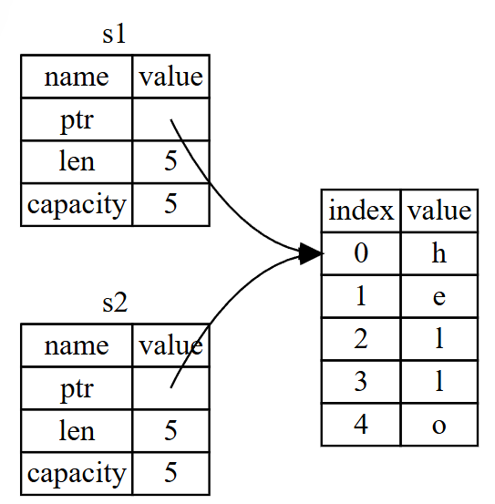
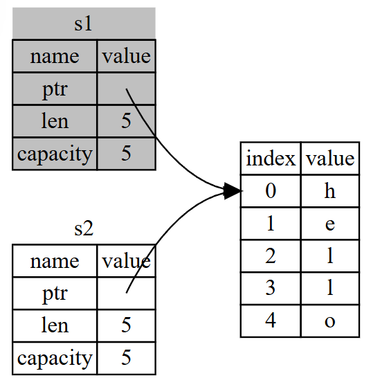

# 认识所有权
所有权是Rust的特性，它让Rust无需垃圾回收器(garbage collector)即可保证内存安全。在本章中，我们将讨论所有权以及相关功能：借用、slice以及Rust如何在内存中存放数据。
## 4.1 什么是所有权？
Rust的核心功能之一是所有权。所有运行的程序都必须使用计算机内存的方式：
* 一些语言具有垃圾回收机制，在程序运行时不断地寻找不再使用的内存
* 有的语言开发者必须亲自分配和释放内存
* Rust：通过所有权系统管理内存，编译器在编译时会根据一系列的规则进行检查。在运行时，所有权系统的任何功能都不会减慢程序

> ### 栈(stack)与堆(Heap)
> 栈和堆都是代码在运行时可供使用的内存，但是它们的结构不同:
> 1. 栈中的所有数据都必须占用已知且固定的大小。将数据推入栈中并不被认为是分配。因为指针的大小是已知并且固定的，可以将指针存储在栈上，不过当需要实际数据时，必须访问指针。
> 2. 在编译时大小未知或大小可能变化的数据，要改为存储在堆上。
> 堆是缺乏组织的：当向堆放入数据时，要请求一定大小的空间。内存分配器(memory allocator)在堆的某处找到一块足够大的空位，把它标记为已使用，并返回一个表示该位置地址的指针(pointer),这个过程称作在堆上分配内存。
>
> 入栈比在堆上分配内存要快，访问堆上的数据比访问栈上的数据慢
> 跟踪那部分代码正在使用堆上的哪些数据，最大限度地减少堆上的重复数据量，以及清理堆上不再使用的数据确保不会耗尽空间，这些问题正是所有权系统要处理的。

### 所有权规则
1. Rust中的每一个值都有一个被称为其**所有者**(owner)的变量
2. 值在任一时刻有且只有一个所有者
3. 当所有者(变量)离开作用域，这个值将被丢弃
### 变量作用域
```rust
fn main() {
    {                      // s 在这里无效, 它尚未声明
        let s = "hello";   // 从此处起，s 开始有效

        // 使用 s
    }                      // 此作用域已结束，s 不再有效
}
```
### String类型
`String`类型管理被分配到堆上的数据，能够存储在编译时未知大小的文本。
```rust
fn main() {
    let mut s = String::from("hello");

    s.push_str(", world!"); // push_str() 在字符串后追加字面值

    println!("{}", s); // 将打印 `hello, world!`
}
```
### 内存与分配
对于`String`类型，为了支持一个可变的、可增长的文本片段，需要在堆上分配一块在编译时未知大小的内存来存放内容：
* 必须在运行时向内存分配器请求内存：当调用`String::from`时，它的实现请求其需要的内存
* 需要一个当我们处理完`String`时将内存返回给分配器的方法
  * 在有垃圾回收的语言中，不需要我们关心它
  * 没有GC的话，需要精确一个`allocate`配对一个`free`
* Rust:内存在拥有它的变量离开作用域后就被自动释放
#### 变量与数据的交互方式(一)：移动
`String`由三部分组成：一个指针、一个长度、一个容量
```rust
fn main() {
    let s1 = String::from("hello");
    let s2 = s1;
}
```
{width="50%" height="50%"}
在`let s2 = s1`之后，Rust认为`s1`不再有效，因此Rust不需要在`s1`离开作用域后清理任何东西，这个操作叫做**移动**
{width="50%" height="50%"}
#### 变量与数据交互的方式(二)：克隆
如果我们需要深度复制`String`中堆上的数据，不仅仅是栈上的数据，可以使用一个叫做`clone`的通用函数
```rust
fn main() {
    let s1 = String::from("hello");
    let s2 = s1.clone();

    println!("s1 = {}, s2 = {}", s1, s2);
}
```
#### 只在栈上的数据：拷贝
```rust
fn main() {
    let x = 5;
    let y = x;

    println!("x = {}, y = {}", x, y);
}
```
像整型这样的在编译时已知大小的类型被整个存储在栈上，所以拷贝其实际的值是快速的。Rust有一个叫做`copy`trait的特殊标注，若实现了`copy`trait，那么一个旧的变量在将其赋值给其他变量后仍然可用。
如下实现`copy`的类型：
1. 整数类型
2. 布尔类型
3. 浮点类型
4. 字符类型
5. 元组，当且仅当其包含的类型也都实现
#### 所有权与函数
将值传递给函数在语义上与给变量赋值相似，向函数传递值可能会移动或者复制
```rust
fn main() {
  let s = String::from("hello");  // s 进入作用域

  takes_ownership(s);             // s 的值移动到函数里 ...
                                  // ... 所以到这里不再有效

  let x = 5;                      // x 进入作用域

  makes_copy(x);                  // x 应该移动函数里，
                                  // 但 i32 是 Copy 的，所以在后面可继续使用 x

} // 这里, x 先移出了作用域，然后是 s。但因为 s 的值已被移走，
  // 所以不会有特殊操作

fn takes_ownership(some_string: String) { // some_string 进入作用域
  println!("{}", some_string);
} // 这里，some_string 移出作用域并调用 `drop` 方法。占用的内存被释放

fn makes_copy(some_integer: i32) { // some_integer 进入作用域
  println!("{}", some_integer);
} // 这里，some_integer 移出作用域。不会有特殊操作
```
当尝试在调用`takes_ownership`后使用`s`时，Rust会在编译时报错
#### 返回值与作用域
变量的所有权总是遵循相同的模式：将值赋给另一个变量时移动它。当持有堆中数据值的变量离开作用域时，其值将通过`drop`被清理掉，除非数据被移动为另一个变量所有
如果我们想要函数使用一个值但不获取所有权，我们可以使用元组来返回多个值
```rust
fn main(){
    let s1 = String::from("hello");

    let(s2, len) = calculate_length(s1);

    println!("The length of '{}' is {}.", s2, len);
}

fn calculate_length(s: String) -> (String, usize){
    let length = s.len();

    (s, length)
}
```

