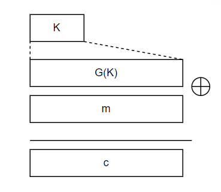
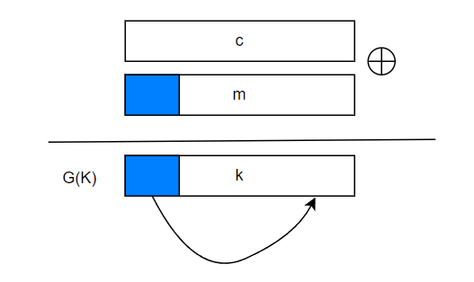

# Stream cipher The One Time Pad
首先先定义密码系统
**[Def]** a cipher defined over $(K,M,C)$ is a pair of algs$(E,D)$,$E:K\times M\rightarrow C,D:K\times C\rightarrow M$
s.t. $\forall m\in M,k\in K:D(k,E(k,m)) = m$(一致性等式)
E通常是随机函数，D总是确定性函数

---
随后给出一个密码系统的例子：
OTP(One Time Pad)
**[Def]**$M=C=\{0,1\}^n,K=\{0,1\}^n$ 密钥$K$是与明文等长的随机序列
$c=E(k,m)=k \oplus m,m=D(k,c)=k\oplus c$
OTP的性能：
1. 加密/解密速度很快
2. 密钥长度太长

---
下面观察OTP的安全性
**[Def]** A cipher$(E,D)$over$(K,M,C)$ has ==perfect secrecy== if $\forall m_0,m_1\in M,|m_0|=|m_1|,\forall c\in C,\operatorname{Pr}[E(k,m_0)=c]=\operatorname{Pr}[E(k,m_1)=c]$,其中，$k$ is uniform in $K$
[对抗CT only attacks]
在这种安全性下，给定CT，敌手无法区分明文$m_0,m_1$
**[Thm]** perfect secrecy $\Rightarrow$ $|K|\geq|M|$

---
由于OTP的密钥过长，很不实用，下面改进使得OTP变得"practical"
引入$PRG$:$PRG$是一个函数，$G:\{0,1\}^s\rightarrow \{0,1\}^n,n>s$

**[Thm]** $PRG$ must be unpredictable
反证:suppose PRG is predictable,$\exist i:G(k)_{1, \ldots ,i}\rightarrow G(k)_{i+1, \ldots ,n}$
Then:

> 比如在对邮件攻击时，由于邮件有相同的抬头，则根据明文的抬头与c异或得到G(K)的前面一部分，即可推出G(K)的后面部分

**[Def]** $PRG$ is predictable,if $\exist "ef f" \,alg\,A\ and\ \exist 1\leq i \leq n-1,s.t. \operatorname{Pr}[A(G(K))|_{1, \ldots ,i}=G(K)_{i+1}]\geq \frac{1}{2}+\epsilon$