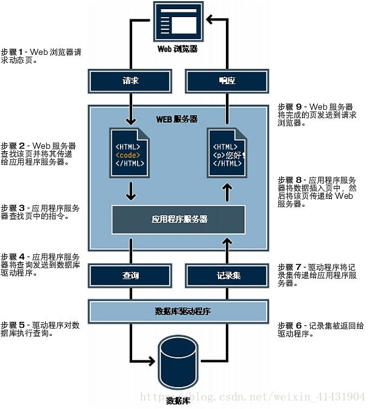
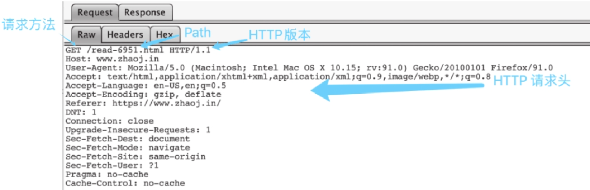
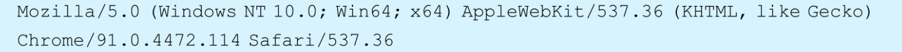
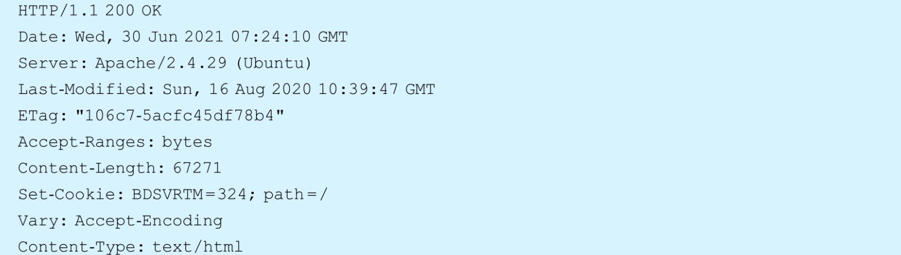

# Web安全基础知识
## 1.1 Web应用体系结构
### 1.1.1 Web应用工作流程
对于一个常见的Web应用来说，通常由数据库、后端和前端组成
{width="50%" height="50%"}
当用户在前端单击一个按钮之后，一个Web应用工作处理流程如下：
1. 后端接收到用户发来的请求，判断用户意图
2. 后端依据用户系统到数据库中更新数据并拉取数据
3. 数据库更新与拉取数据之后，交还给后端
4. 后端进行处理之后，展示给前端
> #### 前端(Frontend)
> 前端是用户直接与之交互的部分，主要涉及用户界面的设计和呈现
> 前端开发的主要职责包括：
> * 用户界面(UI)设计
> * 用户体验(UX)设计
> * 客户端逻辑：处理用户输入、表单验证、动态内容更新等
> 
> 常见的前端技术包括：
> * HTML-创建网页的结构
> * CSS-设计网页的样式
> * JavaScript-实现网页的动态行为和交互功能
> #### 后端(Backend)
> 后端是处理应用程序的业务逻辑、数据库交互和服务器端操作的部分
> 后端开发的主要职责包括：
> * 服务器端逻辑：处理客户端请求、执行业务逻辑、与数据库交互
> * 数据库管理：存储、检索和管理应用程序的数据
> * 身份验证和授权：管理用户的注册、登录和访问权限
> * API(应用程序接口)：为前端提供数据和功能接口
>
> 常见的后端技术包括：
> * 编程语言：Python、Java、Ruby、PHP、JavaScript
> * 数据库：MySQL、PostgreSQL、MongoDB、SQLite
### 1.1.2 Web应用体系结构内的术语
常见名词解释：
1. Apache：网页服务器软件
2. Nginx：网页服务器
3. Tomcat：Servlet容器、网页服务器
4. 中间件(Middleware)：中间件是提供系统软件和应用软件之间连接、便于软件各部件之间沟通的软件；中间件位于客户端/服务器的操作系统上，管理着计算资源和网络通信
5. MySQL
6. PostgreSQL
7. PHP(Hypertext Preprocessor)：在服务器端执行的脚本语言
8. Python

## 1.2 HTTP详解
本节主要介绍HTTP的概念、请求方法、请求状态码、URL和响应头信息
### 1.2.1 HTTP概述
HTTP是一种用于在客户端和服务器之间传输超文本数据的**应用层协议**。
客户端发起一个HTTP请求到服务器上指定端口(默认端口为80)，称为**用户代理程序**(User Agent);应答的服务器上存储着一些资源，称为**源服务器**
客户端使用HTTP格式构造请求包内容，将其发送出去之后，服务器再以HTTP格式来构造应答包，发送回客户端。客户端接收到这个包之后进行解析，最终得到我们看到的网页架构。
### 1.2.2 HTTP请求方法
{width="50%" height="50%"}
HTTP请求方法定义了HTTP请求时所要告诉服务器执行的动作：
* GET：直接获取服务器上的资源
* POST：向服务器发送数据，更新资源信息
* PUT：新增一个数据记录
* PATCH：修改一个数据记录
* DELETE：删除一个数据记录
* HEAD：判断一个资源是否存在
* OPTIONS：获取一个资源自身所具备的约束
### 1.2.3 HTTP请求码
 {width="50%" height="50%"}
 HTTP返回头中会含有一个HTTP状态码
 * **101 Switching Protocols**：切换协议
 * **200 OK**：请求成功
 * **201 Created**：资源创建成果，通常用于回应动词PUT
 * **204 No Content**：不会显任何内容的情况
 * **301 Moved Permanently**：永久跳转
 * **302 Found**：临时跳转
 * **404 Not Found**：所请求资源不存在
 * **405 Method not allowed**：方法不被允许
 * **500 Internal Server Error**：服务器内部错误
 * **502 bad Gateway**:网关在转发内容时出错——通常是转发的下一站后端不可达或返回一些奇怪的信息
 * **504 Gateway Time-out**：网关在转发内容时出错——转发的下一站后端不可达

总结：
* 1xx 代表信息
* 2xx 代表成功
* 3xx 代表重定向
* 4xx 代表客户端出错
* 5xx 代表服务器出错
### 1.2.4 HTTP协议的URL
例子：https://url/read-6951.html?a=1&b=2#tag5
scheme:[//[userinfo@] host[:port]] path[?query] [#fragment]
* **协议scheme**：用于代表这个URL所指向的协议。常见的如HTTP、HTTPS、FTP等。
* **用户信息userinfo**：通常为“用户名：密码”这类格式，会被编码在Authorization头中发向服务器。
* **主机名(host)**：指向网络上的服务器的地址、域名，或者IP地址。• 端口(port)：指向服务器上的端口，如果不填写就会依据协议设置成默认值并且不展示。例如，HTTP是80端口，HTTPS是443端口，FTP是21端口。
* **请求路径(path)**：指向服务器上资源的路径，如/read-6591.html会请求该路径对应的资源。
* **请求参数(query)**：在请求资源时所带的参数，后端可获取到这些参数。例如，a=1&b=2代表有两个参数a和b，值分别为1和2。
* **页面描点(fragment)**：用于指向页面上某个元素，不会被实际发送到服务器，浏览器会进行处理并滚动到该元素出现的地方。
### 1.2.5 HTTP响应头信息
> **HTTP 响应头（HTTP Response Headers）** 是服务器在响应 HTTP 请求时发送给客户端的一组键值对，用于传递关于响应或服务器的附加信息。这些头部信息可以包括内容类型、内容长度、缓存控制、服务器信息、设置 cookie 等等。

## 1.3 HTTP安全
### 1.3.1 URL编码的基本概念
在CTF中，如SQL注入、反序列化、命令执行等题目中常常会有特殊或不可见字符，这些字符无法直接手工输入，这时候就要用到**URL编码**。
URL编码会将这些字符转换成%+16进制的ASCII码

### 1.3.2 UA头伪造漏洞的概念及利用方法
UA头(User-Agent)，每个HTTP请求中都会携带UA头，这个头会包含我们所使用的操作系统版本、CPU、浏览器的类型等

UA头的作用：在Web开发中，一般会根据UA头来判断客户端是用什么设备或者什么浏览器访问来进行页面适配，或者说禁止某些浏览器访问
1. 如何获得UA头：使用ncat监听端口抓取HTTP请求
> **ncat**是一种网络工具，适用于多种网络任务，如端口扫描、数据传输、端口监听、代理和加密通信。
2. 如何修改UA来访问：使用**Burt Suite**抓包拦截修改UA头或**在命令行中**设置UA头
> **Burt Suite**是一个综合性的网络安全测试平台，主要用于对Web应用程序进行安全性测试，支持从初始映射和分析应用程序的攻击面到发现和利用安全漏洞的整个测试过程。
> Burt Suite的主要工具：
> 1. 代理(Proxy):拦截、修改Web流量，帮助测试人员分析和调试HTTP请求和响应
> 2. 扫描器(Scanner)
> 3. 入侵者(Intruder)：用于自动化攻击，例如暴力破解、参数注入等
> 4. 回放工具(Repeater)：允许测试人员手动修改并重新发送HTTP请求，以测试应用程序的响应
> 5. 序列器(Sequencer)：分析应用程序生成的随机令牌或其他随机数据的质量
> 6. 比较器(Comparer):用于对比不同HTTP请求和响应的差异，帮助发现异常

> **curl**是一个用于在命令行或脚本中进行数据传输的工具和库，可以从命令行下载或上传数据，以及进行API调用和网络请求测试。
### 1.3.3 返回头分析方法

从返回包中，可以看到HTTP状态码、响应的时间、中间件信息和Cookie
### 1.3.4 来源伪造漏洞的概念以及利用方法
HTTP请求头中还会携带一个Referer，Referer头会告诉服务器用户是从哪个页面过来的
### 1.3.5 案例解析——[极客大挑战2019]HTTP
## 1.4 基础工具使用
## 1.5 信息泄露
### 1.5.1 Dirsearch扫描器使用
>**Dirsearch**是一个用于暴力破解和扫描Web服务器目录和文件的命令行工具。它通过发送HTTP请求来检测Web服务器上存在的目录和文件，从而帮助安全研究人员和渗透测试人员发现隐藏的资源和可能的攻击面。
### 1.5.2 .git与.svn泄露与利用
若发布时.git文件夹或.svn文件夹未删除就和项目一起发布了，攻击者就可以借此恢复出项目源码。
攻击的工具:
* GitHacker
* svnExploit
### 1.5.3 其他源码泄露
1. 网站备份文件泄露
备份文件泄露是指网站管理员在服务器上备份网站文件时，将这些备份文件（通常是压缩文件）放在了网站的根目录或子目录下，这样的文件可以被访问和下载，从而导致泄露。
2. 交换文件泄露
当使用 `vi` 编辑器编辑文件时，`vi` 会生成一个交换文件（swap file），这些文件用于暂存编辑内容。如果这些交换文件可以被访问，那么就可能通过这些文件恢复出被编辑文件的内容。
3. DS_Store文件泄露
DS_Store文件是macOS的Finder缓存文件，用于存储当前目录下文件的摆放位置等信息。如果攻击者能拿到这个文件，那么就可以获取到当前目录的文件列表，从而发起进一步攻击。
### 1.5.4 实战练习—[Web入门]粗心的小李
