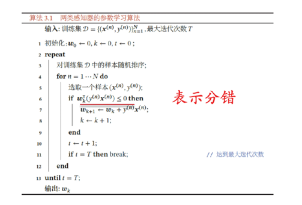

# lecture 2 机器学习基础 I：线性模型
概述了机器学习中线性模型的基础知识，涵盖了线性回归和分类的基本框架、损失函数、优化方法（如梯度下降及其变形），并介绍了如何处理分组线性回归和多分类问题，以及感知机的基本原理和学习算法。

---

[TOC]
## 预测任务概述
predictor $f$ 接受一个输入 $x$ 同时输出一个预测结果 $y$
* 分类任务：$y$通常是类别标签，离散的
* 回归任务：$y$通常是一个实数$\mathbb{R}$
* 结构化预测：$y$是一个复杂的对象

## 线性回归模型的框架

机器学习三要素：
1. **假设空间**(hypothesis class)：模型$f$所处的集合
2. **损失函数**(loss function)：评价假设空间中具体某一个模型的优劣
3. **优化方法**(optimization method)：基于损失函数的引导，在假设空间中寻找最优的模型
### 假设空间

向量表示：**权重向量**：$\vec{w}=[w_1,w_2]$ **特征向量**：$\phi(x)=[1,x]$
$f_w(x)=w\cdot \phi(x)$
**假设空间**：$F = {f_w:w\in \mathbb{R}^2}$
#### 损失函数
损失函数用于评价每个预测器的优劣：对于一个样本$(x,y)$而言，预测的输出$f_w(x)$和真实输出$y$之间的差距被称作残差。一般而言，残差越小预测越准
**残差**：$Loss(x,y,w)$
**训练损失**(训练错误、经验风险):$TrainLoss(w)=\frac{\Sigma_{(x,y)\in D_{train}}Loss(x,y,w)}{|D_{train}|}$
常用的损失函数：**平方损失函数**(Squared loss)$Loss(x,y,w)=(f_w(x)-y)^2$
### 优化算法
**Goal**：$\min_w TrainLoss(w)$
**梯度**：$\nabla_wTrainLoss(w)$是训练损失增加最快的⽅向
**优化算法**：梯度下降(gradient descent)
梯度下降是⼀种迭代式优化，我们从某⼀个随机的权重参数开始，然后每次都对他进⾏调整使得损失变⼩，这样我们就可以逐步的得到⼀个较好的预测器

其中，$\eta$称为**学习率**(learning rate),$T$称为**回合数**(epoch)
## 分组线性回归模型

对于这种训练数据中出现明显分组现象的情况，⼀个简单的线性回归预测器很难同时兼顾不同组之间的数据。⼀个⾮常重要的问题是如何在不同组之间折衷权衡
* **平均损失**:$TrainLoss(w)$训练数据的所有样本上的平均
* **分组损失**：$TrainLoss_g(w)=\frac{\Sigma_{(x,y)\in D_{train}(g)}Loss(x,y,w)}{|D_{train}(g)|}$每个组中的样本上的平均
* **最大组损失**：$TrainLoss_{\max}(w)=\max_g TrainLoss_g(w)$所有组之间的最⼤分组损失
 ## 线性分类模型
 
 **假设空间**：$F={f_w:w\in \mathbb{R}^2}$,其中,$f_w=\operatorname{sign}(w\cdot \phi(x))$
 **损失函数**：适用于分类的损失函数
 * 0-1损失：$Loss_{0-1}(x,y,w)=1[f_w(x)\neq y]$
   * 分数(score)：$w\cdot \phi(x)$体现了分类器将$x$分类正类（+1）的置信度
   * 间隔(margin)：$(w\cdot \phi(x))y$ 这个值反映了预测的正确性，间隔越⼤，预测就越正确；如果间隔是⾮正的(≤0)，那么说明分错了

这时我们会遇到问题：0-1损失函数在⼏乎所有地⽅都是平的（除了在间隔等于0的地⽅），因此⼏乎所有地⽅的梯度都是零，在具有零梯度的函数上运⾏梯度下降，会⽆法收敛（⽆法更新参数）
* Hinge损失(铰链损失)
  
  * $Loss_{hinge}(x,y,w)=\max{1-(w\cdot \phi(x))y,0}$
  * Hinge损失的梯度:$\nabla Loss_{hinge}(x,y,w)=\begin{cases} -\phi(x)y,\ if\ 1-(w\cdot \phi(x))y>0 &  \\ 0,\  \text{otherwise}&  \end{cases}$
* 逻辑损失(logistic loss)
对应的方法叫逻辑回归(logistic regression),逻辑回归虽然叫"回归"，但是却是⽤来做分类任务的 
  * $Loss_{\logistic}(x,y,w)=\log(1+e^{-(w\cdot \phi(x))y}$

  *激活函数：sigmoid函数$sigmoid(z)=\frac{1}{1+e^{-z}}$   
## 感知机(perception)
模拟生物神经元行为的机器，有与生物神经元相对应的部件，如权重(突触)、偏置(阈值)、激活函数(细胞体)，输出为+1或-1

学习算法：错误驱动的在线学习算法
* 先初始化一个权重向量(通常是全0向量)
* 每次分错一个样本时，即$ywx<0$，用这个样本来更新权重，$w\leftarrow w+yx$
* 根据感知机的学习策略，可以反推出感知器的损失函数为$\max(0,-ywx)$

## 梯度下降的变形
* 原始的梯度下降计算非常慢，迭代的每一步都需要遍历整个训练集来计算训练损失

* 随机梯度下降

随机梯度下降每⼀次更新只计算⼀个样本对应的梯度。这样好处是：每⼀次更新所需要的时间就会⼤幅缩短，缺点是：仅依赖⼀个样本确定的更新⽅向可能不太靠谱
* mini-batch梯度下降(批量随机梯度下降)
每⼀步更新时需要计算 个样本上的梯度，并进⾏更新，这 个样本称作⼀个批次（batch）， 被称为批量⼤⼩（batch size）这是⼀个常⽤的重要超参数
## 步长/学习率

⼀般来说，越⼤的学习率会收敛的更快，但是训练过程会不太稳定，极端情况下甚⾄不收敛。相反，较⼩的学习率会使得收敛变慢，耗时变⻓，但是相应的收敛过程也会更加稳定。当学习率设为0时，优化过程不会收敛，什么都不会发⽣(等于没有优化)
## 从二分类到多分类
* ⼀对其余（one vs all） 
假设多分类的类别是K个，那么⼀共需要训练K个⼆分类器，其中每个⼆分类器将第k类样本作为正例，其余都作为负例

* ⼀对⼀（one vs one）
假设多分类的类别为K个，那么⼀共需要训练$\frac{K(K-1)}{2}$个⼆分类器。新的样本到来时，遍历⼀遍所有⼆分类器，最终得到的结果频次最多的类就是最终该样本的分类结果（投票、集成）