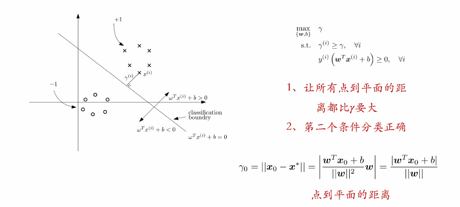
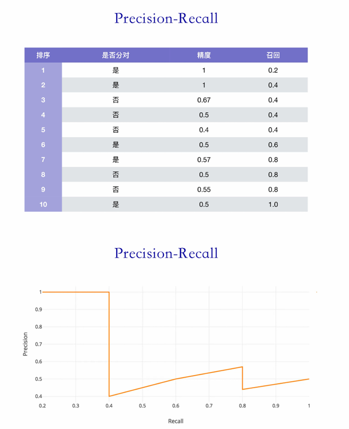

# 机器学习基础II：支撑向量机
[TOC]
## 背景知识
### Norm范数
Norm范数：Norm是将非零向量映射为正数的函数
Norm的性质：
    1. 齐次性：$||\alpha x||=|\alpha|||x||,for\ x\in\mathbb{R}^N\ and\ \alpha\in \mathbb{R}$
    2. 三角不等式：$||x+y||\leq||x||+||y||,for\ x,y\in\mathbb{R}^N$
    3. 分离性：$If\ and\ only\ if\ ||x||=0,then\ x=0$
常见的Norm计算公式：$p\geq 1,a\in\mathbb{R}^N,||a||_{p}= \left(\sum_{i=1}^{N}|a_i|^p\right)^{\frac{1}{p}}$
[Lemma](Minkowski's inequality)$1\leq p\leq \infty,||a+b||_{p}\leq||a||_{p}+||b||_{p}$
[Definition]($l_p\ ball$)$\epsilon\geq 0,B_{l_p}(\epsilon)=B_p(\epsilon)=\{a|\ ||a||_{p}\leq \epsilon\}$

### 函数的凹凸性

### 优化问题

* 无约束的优化问题使用牛顿法解决：
牛顿法的基本思想是通过构造函数的泰勒级数展开来近似原函数，并使用近似函数的根或最小值来逐步逼近原函数的根或最小值。在每一次迭代中，牛顿法使用当前点的切线来估计函数的根或最小值，并将切线与x轴的交点作为下一次迭代的点。
$$
\begin{aligned}
f(x) & = \frac{1}{0！}f(x_0)+\frac{1}{1!}(x-x_0)f'(x_0)+\frac{1}{2!}(x-x_0)^2f''(x_0)+ \cdots +\frac{1}{n!}(x-x_0)^nf^{(n)}(x_0)+R_n  \\
\end{aligned}
$$
截断：$f(x)  = \frac{1}{0！}f(x_0)+\frac{1}{1!}(x-x_0)f'(x_0)+\frac{1}{2!}(x-x_0)^2f''(x_0)$
重写公式：$\varphi(x)  = \frac{1}{0！}f(x^{(k)})+\frac{1}{1!}(x-x^{(k)})f'(x^{(k)})+\frac{1}{2!}(x-x^{(k)})^2f''(x^{(k)})$
求导后令其为0：$\varphi'(x)=f'(x^{(k)})+f''(x^{(k)})(x-x^{(k)})=0$
得到切线与x轴的交点:$x^{(k+1)}=x^{(k)}-\frac{f'(x^{(k)})}{f''(x^{(k)})}$
* 有约束的优化问题使用拉格朗日法：
1. 将有约束的问题转化为无约束的问题：通过构建拉格朗日函数$L(x,\lambda,v)$，令其偏导数都等于0，求得的解都满足原问题的等式约束；随后从这些解里寻找局部最优解

2. 既含等式约束又含不等式约束的优化问题，要使得KKT条件成立：

假如先不考虑$f_i(x)\leq 0$这个条件， KKT条件会变为$h_i(x^*)=\nabla_{v_i}L=0,\nabla_xf_0(x^*)+\Sigma_{i=1}^p v_i^* \nabla_x h_i(x^*)=0$这两个条件,也就是五个条件⾥⾯的第⼆⾏和最后⼀行。

## 支撑向量机
1. 基本推导
先用拉格朗日法计算点到平面的距离，约束条件是点必须在平面$w^Tx+b=0$上。

2. 进入SVM
SVM的目标在于：找到一个平面能够正确地分开两个类别，且让两个类别的中任意一个点到该平面的最短距离尽可能大

对于第一个条件，代入点到平面的距离公式；第二条件代入分类对的条件进行化简

因为我们的目标只需求一个平面表达式，下面去掉$\lambda$和$w$

以上SVM的形式叫Hard SVM，它不允许分类出错；这可能导致模型为一些与真实分布差的很远的样本而划出一个较差的平面

因此，我们引入Soft SVM：对于第$i$个点，若$\xi_i=0$,即该点分类正确；若$\xi_i>0$，分类错误。我们在优化时需要出错的累积最小$\min \Sigma_{i=1}^{m}\xi_i$

3. 核函数
核函数的意义在于，当⼀堆点在低维空间不能做到线性可分的情况下，我们将它映射到更⾼维让它们变得可分

对于Hard SVM，先将原问题转化为对偶问题，将优化条件转化为$f_i=1-y^{(i)}(w^Tx^{(i)}+b)\leq 0$
同时代入KKT条件的最后一个条件，计算$L$对平面参数的梯度：$\nabla_w L=0$和$\nabla_b L=0$

随后将第一个式子关于$w^*$的式子代入$L$并化简

得到新的$L$函数：$L=\Sigma_{i=1}^m \alpha_i-\frac{1}{2}\Sigma_{i,j=1}^m \alpha_i \alpha_j y^{(i)} y^{(j)}<x^(i),x^(j)>$
在新的$L$函数下，我们需要最小化$ y^{(i)} y^{(j)}<x^(i),x^(j)>$

我们可以将点 的特征通过⼀个映射函数 映射到更⾼维度。例如原先样本点的特征个数是三维，我们可以设计下图的函数将特征的个数从三维映射到九维：

## 模型的迭代
下面介绍模型训练、评价和泛化能力的介绍
### 训练集和测试集
对于⼀批已有的样本，我们⼀般将它们划分为训练集和测试集两个部分。训练集对模型可⻅，测试集对模型不可⻅
下面是一些常见的训练集、测试集划分方法：
* 留出法

* 交叉验证法

* 留一法

* 自助法

* 验证集
验证集是可⻅样本中的⼀个⼦集。在训练集上训练模型后，我们在验证集验证性能。根据性能好坏，调整训练策略、模型结构等⼈为设定的超参数。如此往复迭代，找到最好的模型。最后⼀般将训练集和验证集重新拼在⼀起训练模型，并在测试集评估最终性能。

### 模型的评价
为了衡量一个机器学习模型的好坏，需要模型对测试集中的每一个样本进行预测，并根据预测结果计算评价分数，不同学习任务模型性能的评价标准不同
1. 回归模型常用均方误差

2. 分类模型常用准确率

3. 若数据集非常不平衡，使用混淆矩阵

其中：Positive表示正类，Negative表示负类
* TP-预测与真实都是正类，预测成功
* TN-预测与真实都是负类，预测成功
* FP-预测正类，真实负类，预测失败
* FN-预测负类，真实正类，预测失败

4. 精确率、召回率、准确率
* 精确率

* 召回率

5. PR曲线、平均精度AP
PR曲线的横坐标为召回率R，纵坐标为查准率P，绘制步骤如下：
* 将预测结果按照预测为正类概率值降序排列；
* 从第⼀个样本开始（模型预测为正类概率最⾼）。对该样本，我们认为模型把它分为正类，如果它标签确实是正类，那么分类正确；反之错误。
* 对于第k个样本，我们将它以及它之前的样本（编号1-k）均视为模型分成正类。判断这些样本是否分对。对该第k个样本，精度P=前k个模型分对的个数/k，召回R=前k个模型分对的个数/10个样本总共的正样本数量。如此对后续所有10个样本计算精度和召回。
* 以P为纵坐标，R为横坐标绘制点，将所有点连成曲线后构成PR曲线。 
【例子】

下面计算平均精度AP：
* 绘制绿线

* 计算

平衡点：一般平衡点越靠右上，模型性能越优秀

### 泛化能力

1. 泛化能力(Generalizability)：指由该方法学习到的模型对未知数据的预测能力
2. 误差：
   * 经验误差：训练集上的误差$\frac{1}{m^{(train)}}||X^{(train)}w-y^{(train)}||$
   * 泛化误差：测试集上的误差$\frac{1}{m^{(test)}}||X^{(test)}w-y^{(train)}||$
泛化误差是泛化能力的一种度量，是所学习到的模型的期望风险
   * 泛化误差上界
泛化误差是指由训练集泛化⾄训练集外的过程中产⽣的误差。上界指它的最⼤值。d表示假设空间：

3. ⽋拟合、过拟合、针对的训练策略
* 欠拟合：经验误差和泛化误差都非常高
  * 改用表达能力更强的模型
  * 增加训练迭代次数
* 过拟合：经验误差降低，泛化误差反升
  * 增大训练数据
  * 参数正则化

  * 早停止策略

4. 偏差与方差
* 偏差(bias):期望输出$\overline{f}(x)$与真实标记$y$的偏离程度
$$bias^2(x)=(\overline{f}(x)-y)^2$$
* 方差(Variance):$x$在训练集$D$上学得模型$f(x;D)$上的输出与期望输出$\overline{f}(x)$之间的变动导致的学习性能的变化
$$var(x)=E_D[(f(x;D)-\overline{f}(x))^2]$$
噪声:$\epsilon^2=E_D[(y_D-y)^2]$
计算测试误差的期望：

$E(f;D)=var(x)+bias^2(x)+\\epsilon^2$

* 偏差、方差与拟合

