# 机器学习基础III：无监督学习
## 无监督学习概述
无监督学习是从无标注的数据中学习数据的统计规律或者内在结构的机器学习方法，主要包括：
1. 聚类：将样本集合中相似的样本分配到相同的类，不相似的分配到不同的类
2. 降维：将训练数据中的样本从高维空间转换到低维空间
3. 概率模型估计：假设训练数据由一个概率模型生成，由训练数据学习概率模型的结构和参数
## 聚类
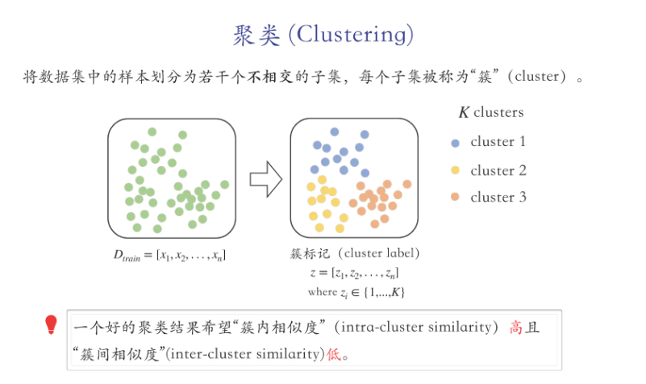
由于聚类是根据样本间的相似度或距离对数据进行划分，因此聚类的一个核心概念是相似度或距离
#### 距离度量
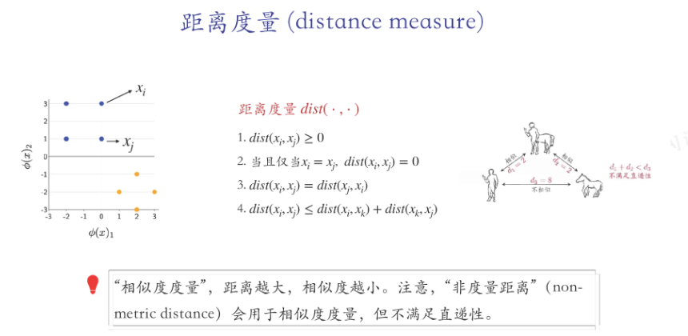
常见的距离度量有：
* 闵可夫斯基距离
$$dist_{mk}(x_i,x_j)=\left(\Sigma_{d=1}^n|x_{i,d}-x_{j,d}|^p\right)^{\frac{1}{p}},p\geq 1$$,记为$||x_j-x_i||_p$
当$p=2$时，称为欧氏距离；$p=1$时，称为曼哈顿距离；$p=\infty$时，称为切比雪夫距离
* 马哈拉诺比斯距离
聚类的簇可以用中心点来进行表示：
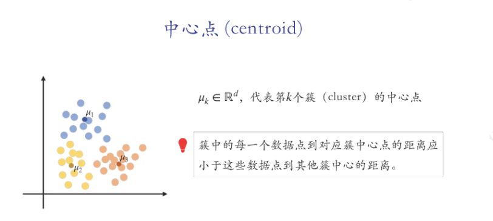
### 硬聚类算法——K均值算法
硬聚类：每个样本只能属于一个类
K均值算法：将样本集合划分为k个子集，构成k个类，将n个样本划到k个类中，每个样本到其所属类的中心的距离最小
划分向量$z=[z_1,z_2, \ldots ,z_n]$,簇中心$\mu=[\mu_1,\mu_2, \ldots ,\mu_k]$
我们考察每一个数据点$x_i$到其所属簇中心$\mu_{z_i}$的欧氏距离，将所有距离相加得到$Loss(z,\mu)$
优化目标：$\min_z\min_{\mu}Loss(z,\mu)$
K-均值算法步骤如下：
1. 随机设置$K$个中心点，遍历所有数据点，将每个点分配给距离最近的中心点
最小化函数$\Sigma_{i=1}^n||x^{(i)}-\mu_{z^{(i)}}||^2$,即最小化$\min_{z^{(i)}}||x^{(i)}-\mu_{z^{(i)}}||^2$
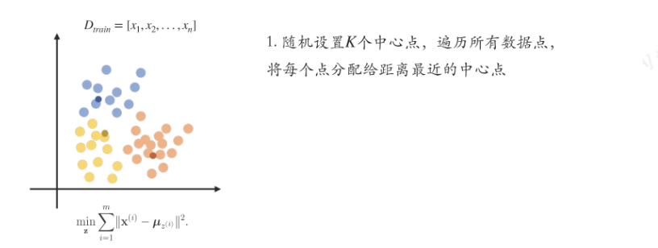
2. 移动中心点到同类数据点的均值处
固定划分向量$z$的前提下，将$\mu$作为变量，在每个簇中选取新的中心点
即：$\mu_j^*=\frac{1}{|i|z^{(i)}=j|}\sum_{i\in\{i|z^{(i)}=j\}}x^{(i)}$
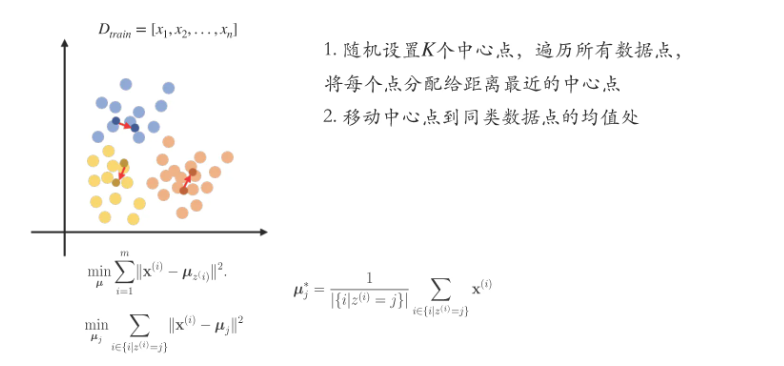
3. 重复分配数据点给新的中心点
4. 重复上述操作，直到中心点位置不再变化
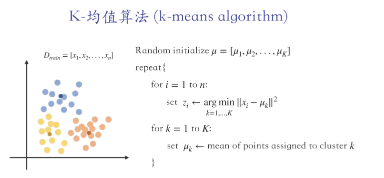
K-均值算法可以处理一些计算机视觉问题，如图像分割，可以将RGB像素值相近的像素进行聚类，就可以近似实现语义层次的分割。原理在于，一张图片中的同一个物体的不同像素通常倾向于拥有相近的颜色

### 软聚类算法——高斯混合模型EM算法
高斯混合模型的概率密度函数是由多个高斯分布组成，我们希望根据观测到的数据，估计出高斯混合模型的参数
模型的参数包括：选取每个高斯分布的概率、每个高斯分布的均值(均值向量)、方差(协方差矩阵)
使用EM(Expectation-maximization)算法进行模型的参数估计
#### 高斯概率密度函数
1. 对于一维空间，高斯分布的参数包括均值$\mu$和标准差$\sigma$
$$P(x,\theta)=\frac{1}{\sqrt{2\pi\sigma}}e^{(-\frac{(x-\mu)^2}{2\sigma^2})}$$
2. 对于高维空间，高斯分布的参数包括均值向量$\mu$和协方差矩阵$\Sigma$
$$P(x,\theta)=\frac{1}{(2\pi)^{\frac{D}{2}}\Sigma^{\frac{1}{2}}}e^{-\frac{(x-\mu)^T\Sigma^{-1}(x-\mu)}{2}}$$
#### 高斯混合模型(GMM)
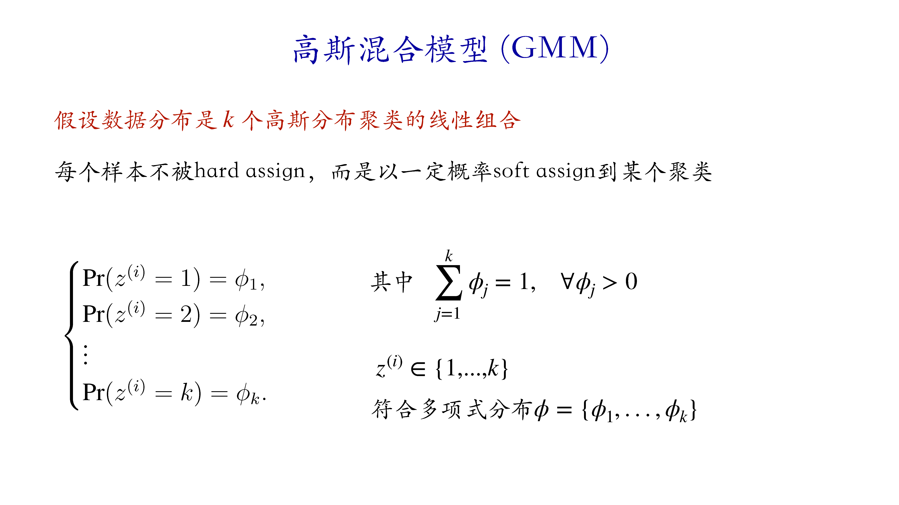
假设数据分布是$k$个高斯分布的线性组合，我们认为样本点以一定的概率属于某个高斯分布：
* 假如我们有一堆观测到的样本点，其中每个样本点都是通过如下的采样方式得到：首先按照$\phi_j$的概率选择第$j$个高斯分布，随后根据第$j$个高斯分布的概率密度函数$N(\mu_j,\Sigma_j)$从该分布中抽样得到样本点
* 我们引入隐变量:每个样本点$i$都对应一个隐变量$z^{(i)}$，有$P(z^{(i)}=j)=\phi_j$
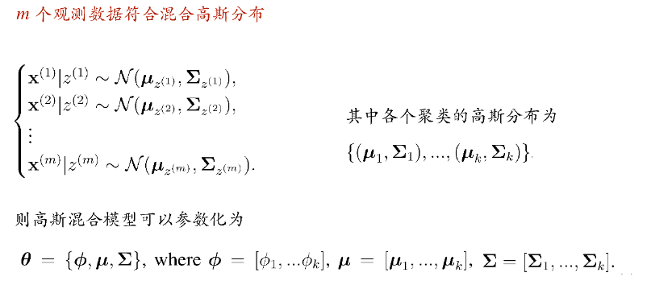
对于给定的模型$\theta$和样本$x^{(i)}$，如何求得$x^{(i)}$s属于聚类$z^{(i)}$的条件概率$p(z^{(i)}|x^{(i)},\theta)$
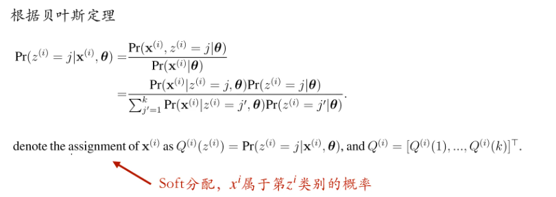
可以利用EM算法来迭代地优化模型参数$\theta$，我们在这里提前给出步骤和公式：
* ● 输入：$\{x^{(i)}\}_{i=1}^m$，模型参数：$\theta = \{\phi, \mu, \Sigma\}$
● 算法步骤如下：
  * 随机初始化参数$\theta^{(0)} = \{\phi^{(0)}, \mu^{(0)}, \Sigma^{(0)}\} = \{\phi_1^{(0)}, \dots, \phi_k^{(0)}, \mu_1^{(0)}, \dots, \mu_k^{(0)}, \Sigma_1^{(0)}, \dots, \Sigma_k^{(0)}\}$
  * 由当前参数$\theta^{(t)}$，根据$Q^{(i, t)}(j)=P(z^{(i)} = j \vert x^{(i)}, \theta^{(t)}) = \frac{\mathcal{N}(x^{(i)} | \mu_j^{(t)}, \Sigma_j^{(t)}) \cdot \phi_j^{(t)}}{\sum_{j^{\prime}=1}^k{\mathcal{N}(x^{(i)} | \mu_{j^{\prime}}^{(t)}, \Sigma_{j^{\prime}}^{(t)}) \cdot \phi_{j^{\prime}}^{(t)}}}$
  计算出$Q^{(i, t)}(j)$，从而得到某个样本点的$Q^{(i,t)} = [Q^{(i,t)}(1), \dots, Q^{(i,t)}(k)]^T$，进而得到$\{Q^{(i,t)}\}_{i=1}^m$
  * 根据$\{Q^{(i,t)}\}_{i=1}^m$更新$(t+1)$步的参数：
    ■ $\phi_j^{(t+1)}=\frac{1}{m}\sum_{i=1}^{m}{Q^{(i,t)}(j)}$
    ■ $\mu_j^{(t+1)} = \frac{\sum_{i=1}^{m}{Q^{(i,t)}(j)}\cdot x^{(i)}}{\sum_{i=1}^{m}{Q^{(i,t)}(j)}}$
    ■ $\Sigma_j^{(t+1)} = \frac{\sum_{i=1}^{m}{Q^{(i,t)}(j)}\cdot (x^{(i)}-\mu_j^{(t)})(x^{(i)}-\mu_j^{(t)})^T}{\sum_{i=1}^{m}{Q^{(i,t)}(j)}}$
  *   重复b步和c步，直到满足临界条件（如$\Vert \theta^{(t+1)} - \theta^{(t)} \Vert < \epsilon$）
  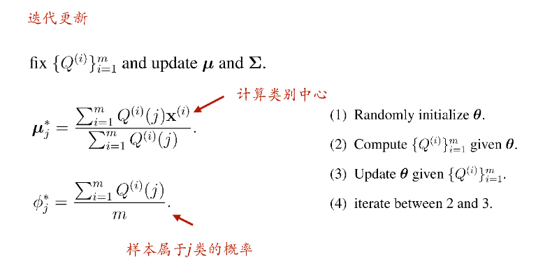
  #### GMM的参数估计问题
  ##### GMM不能使用极大似然估计
  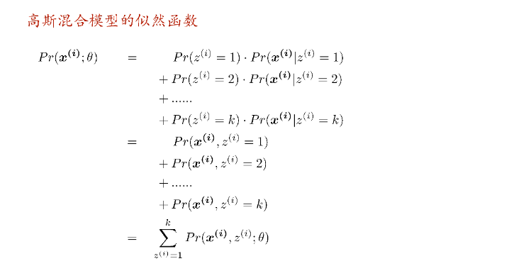
  ● 问题的关键在于GMM中引入了隐变量
● 首先我们写出GMM的似然函数
  ○ 由全概率公式，
$$\begin{align}
P(x^{(i)}|\theta) & = P(x^{(i)}, z^{(i)}=1|\theta) + P(x^{(i)}, z^{(i)}=2|\theta) + \dots + P(x^{(i)}, z^{(i)}=k|\theta) \\
& = \sum_{z^{(i)}=1}^k{P(x^{(i)}, z^{(i)}|\theta)}
\end{align}$$
  ○ 令$X=\{x^{(i)}\}_{i=1}^{m}$，由于每个样本采样过程相互独立，则
$$\begin{align}
P(X|\theta) & = \prod_{i=1}^m{P(x^{(i)}|\theta)} \\
& = \prod_{i=1}^m{\left(\sum_{z^{(i)}=1}^k{P(x^{(i)}, z^{(i)}|\theta)}\right)}
\end{align}$$
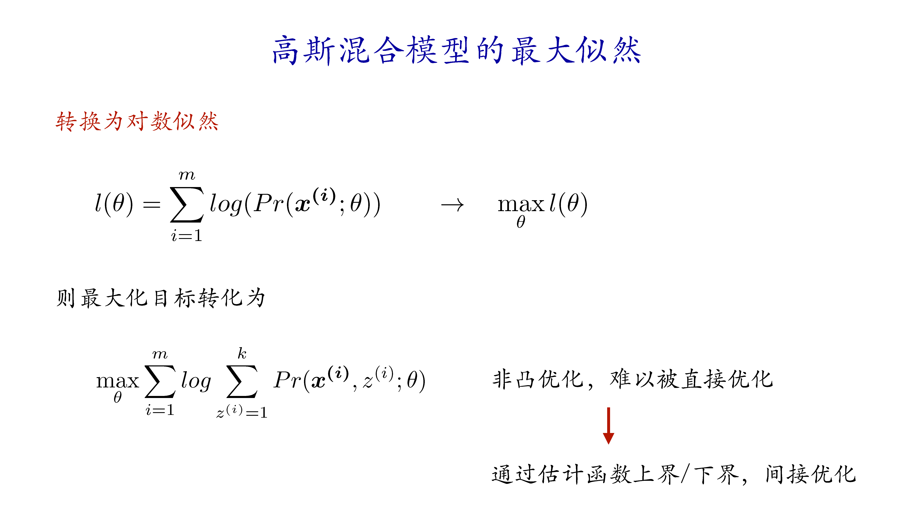
● 取对数，得到对数似然：
$$\begin{align}
l(\theta) & = \log P(X|\theta) \\
& = \sum_{i=1}^m{\left(\log \sum_{z^{(i)}=1}^k{P(x^{(i)}, z^{(i)}|\theta)}\right)}
\end{align}$$
● 由于引入了隐变量，对数似然函数的对数里有若干项求和，很难被直接优化
● 假设没有隐变量，那么对数里面很可能只有一项，这样子的函数是凸函数，对模型的各个参数求偏导会容易很多，也容易优化，可以使用极大似然估计法
//TODO 最大似然估计

