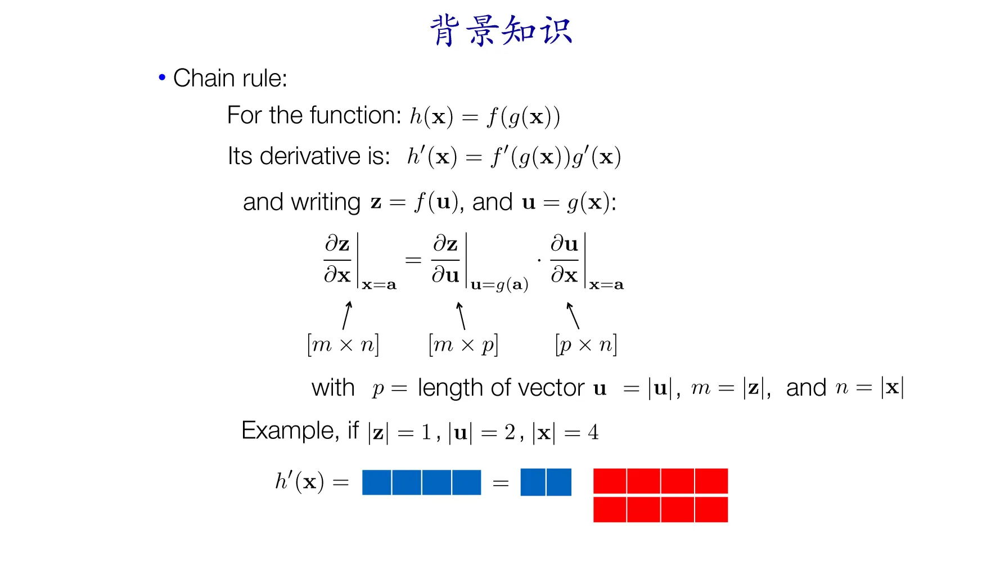
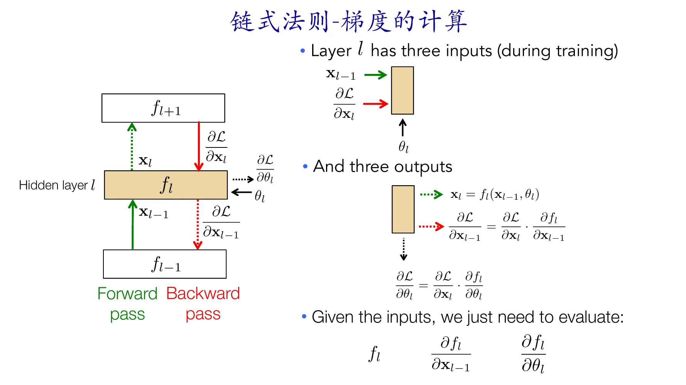

# 深度学习基础I：神经网络
[TOC]
## 传统图像分类

传统图像分类通过手工提取特征或者特征学习方法对整个图像进行描述，然后使用分类器判别物体类别。
传统图像分类方法通常包括底层特征学习、特征编码、空间约束、分类器设计、模型融合等几个阶段：
* 底层特征提取：通常从图像中按照固定步长、尺度提取大量局部特征描述。
    ■ 常用的局部特征包括：SIFT（Scale-Invariant Feature Transform, 尺度不变特征转换） 、HOG(Histogram of Oriented Gradient, 方向梯度直方图) 、LBP(Local Bianray Pattern, 局部二值模式) 等
    ■ 一般也采用多种特征描述，防止丢失过多的有用信息。
* 特征编码：底层特征中包含了大量冗余与噪声，为了提高特征表达的鲁棒性，需要使用一种特征变换算法对底层特征进行编码
* 空间特征约束： 特征编码之后一般会经过空间特征约束，也称作特征汇聚。特征汇聚是指在一个空间范围内，对每一维特征取最大值或者平均值，可以获得一定特征不变形的特征表达。
* 分类器分类: 经过前面步骤之后一张图像可以用一个固定维度的向量进行描述，接下来就是经过分类器对图像进行分类。通常使用的分类器包括SVM(Support Vector Machine, 支持向量机)、随机森林等。
## 深度学习

1. 深度学习方法通过神经网络自动学习特征
2. 深度学习方法通常使用深层神经网络，如cnn、rnn等。这些模型有多层非线性变换，适用于复杂的图像分类任务
3. 深度学习方法对于大规模标注数据的需求更高，模型的性能通常随着数据量的增加而增加
4. 深度学习的损失函数是用来衡量预测结果与真是标签之间的差异的函数
## 单层神经网络

单层神经网络也称为感知机或线性模型，每个神经元的输出可以表示为：
$$z=\sum_{i=1}^n w_i\cdot x_i+b$$
然后，通过一个激活函数$g(z)$将$z$转换为神经元输出
## 非线性单元
非线性单元（Nonlinear units）在神经网络中用于引入非线性变换，从而增加模型的表达能力，使其能够学习更复杂的函数关系。
在神经网络中，非线性单元通常作为激活函数（Activation Function）来使用，它们将输入信号进行非线性映射，产生输出。这些激活函数在隐藏层中引入了非线性，使得神经网络能够学习到非线性关系。 
### Sigmoid函数
将输入值映射到[0,1],公式为：
$$\sigma(z)=\frac{1}{1+e^{-z}}$$
### Tanh函数

* Tanh函数在0附近的梯度较大，有助于减少梯度消失的问题，并使得神经网络的训练速度更快
* 与Sigmoid函数相比，Tanh函数的输出范围更广，因此它的输出更容易产生较大的梯度，有助于更快地训练神经网络
### ReLU函数(Rectified Linear Unit)
对于输入值小于零的部分，输出为零；对于大于零的部分，输出等于输入值。

* **稀疏激活性**：输入为负时，输出为0，激活的神经元被抑制
* **减少梯度消失问题**：ReLU函数在输入为正时梯度为1
* **计算高效**：计算简单，只需比较输入值和0
* **缺点(神经元死亡问题)**:在训练过程中，如果某些神经元的权重被调整到负数，那么这些神经元就会永远处于非活跃状态，无法更新其权重。
### Leaky ReLU函数
在输入值小于零时不再直接输出零，而是输出一个非零的小值
$$LeakyReLU(z)=\begin{cases} z,&\qquad if\ z>0   \\ \alpha\cdot z,&\qquad \text{otherwise}   \end{cases}$$
其中，$\alpha$  是一个小于 1 的超参数，通常取一个很小的值，比如0.01。
### 神经网络结构

### 预测结果

深度学习的一个重要方面是代价函数的选取
* 代价函数给出的是单个样本的损失，损失函数是代价函数在所有样本上的和
* 通常神经网络的代价函数与传统模型的代价函数相同

大多数现代的神经网络采用最大似然准则，令代价函数为负的对数似然函数。

1. logits：
   * Logits是指模型在没有经过Softmax或其他概率分布转换转换之前的原始输出，它通常是网络最后一层的输出，也称为未归一化的概率分数
   * Logits 可以是任意实数值，这些值通常反映了模型对每个类别的置信程度，但并不是直接的概率值。
   * 在进行多分类任务时，模型通常输出一组 logits，每个类别对应一个 logits 值。
2. Softmax：
Softmax是一个激活函数，用于将logits转换为概率分布，使其范围在[0,1]，且概率之和为1
$$Softmax(z_i)=\frac{e^{z_i}}{\sum^{n}_{j=1}e^{z_j}}$$

在批量训练中，损失函数通常是针对单个样本计算的。然后，这些损失值被累加或平均以得到整个批次的总体损失值，然后再基于该总体损失值进行模型参数的更新。
### 每层的意义

* 在神经网络中，数据被传递到网络的每一层，并在每一层中经历一系列的变换。
* 每一层的输出可以被看作是对输入数据的一种不同的表示或者表征，这种表示的转换是由网络中的参数(例如权重和偏置)所决定的
### 张量Tensor

在线性层(也称为全连接层)中，通常进行矩阵乘法操作，以将输入张量映射到输出张量。在这个过程中，输入张量的维度会发生变化
### 梯度下降(Gradient Descent)

梯度下降是一种优化算法，用于最小化损失函数并更新模型参数，以使模型的预测尽可能接近真实标签。
梯度下降的一个迭代(Iteration)包括以下步骤：
1. **计算损失函数相对于模型参数的梯度**
根据损失函数的定义，计算损失函数关于每个模型参数的偏导数，即损失函数的梯度。
2. **更新模型参数**
学习率决定了每次参数更新的步长，它是一个超参数，需要根据具体问题和模型进行调整。
### 链式法则
#### 计算图

● 在深度学习中，通常使用的计算图形式为有向无环图（Directed Acyclic Graphs，DAGs）。
● 这些计算图由一系列的节点（Nodes）组成，节点之间通过边（Edges）连接，每个节点代表一个函数或操作。
● 这些计算图的每个节点都是可微的（Differentiable），这意味着可以计算节点输出相对于输入的导数。
#### 链式法则

● 模型由多层组成，每一层有自己的权重参数 $\theta_l$ 。	
● 每一层的前向传播过程$f_l$将输入 $x_{l-1}$ 经过当前层的权重参数 $\theta_l$进行计算，得到输出 $x_l$。
●  $\mathcal{L}$用于衡量模型的预测输出 $x_L$ 与真实标签 $y$ 之间的差异。
● 总的cost是所有训练样本的损失之和。
● MLP：多层感知机（Multilayer Perceptron），它由多个层组成，包括输入层、若干个隐藏层和输出层。每个隐藏层通常包含多个神经元，每个神经元都与前一层的所有神经元连接，形成全连接结构。
#### 张量链式法则计算
 

#### 链式法则-梯度计算

● 计算损失函数 $J$关于网络每个参数 $\theta_i$ 的梯度，我们实际上是想知道当每个参数 $\theta_i$ 被改变时，损失函数 $J$ 的变化量是多少。

● 这个梯度，记为 $\frac{\partial J}{\partial \theta_i}$，表示损失函数相对于参数 $\theta_i$ 的变化率。
当我们改变参数 $\theta_i$ 时，损失函数的变化量取决于两个因素的乘积：
1. 改变最后一层输出时损失变化的程度。
2. 改变层参数时输出变化的程度。
● $\frac{\partial L}{\partial x_L}$:损失函数 ( J ) 对最后一层输出 ( $x_L$ ) 的变化率。
● $\frac{\partial x_L}{\partial\theta_L}$:表示最后一层输出 ( $x_L$ ) 对参数 ( $\theta_i$ ) 的变化率。
这个乘积表示了当我们改变参数 $\theta_i$  时，损失函数 $J$ 的变化程度。这个关系是反向传播算法的核心思想之一，它指导我们如何调整每个参数以最小化损失函数。

要计算倒数第二层和第二层以及第一层的参数更新，我们可以利用一些梯度计算中共享的项。

### 正向传播与反向传播
正向传播（Forward Propagation）和反向传播（Backward Propagation）是深度学习中两个关键的步骤，用于计算神经网络模型的输出和更新模型参数。

1. **正向传播**：
   * 正向传播是指从输入数据开始，沿着神经网络的前向路径，逐层计算每层的输出，直到得到最终的模型输出
   * 在正向传播中，输入数据通过每一层的权重和偏置进行线性变换，然后通过激活函数进行非线性变换，最终得到输出
   * 正向传播的结果是模型的预测输出，这个过程不涉及参数更新，只是根据当前参数进行预测
2. **反向传播**：
   * 反向传播是指根据模型的预测输出和真实标签之间的差异(即损失)，通过链式法则计算损失函数相对于模型参数的梯度
   * 反向传播的结果是模型参数的梯度，并利用这些梯度来更新模型参数。
3. **参数更新(Parameter Update)**：
  计算损失函数相对于网络参数（通常是权重）的梯度，并使用优化算法（如梯度下降）来更新参数。通过将参数沿着梯度的负方向进行微小调整，使得损失函数逐渐减小，从而提高模型的性能。 

接下来解释参数更新的过程：

### 后向传播求导
* **后向传播可对任意节点求导**
* **后向传播可对变量求导**

* **后向传播可对输入求导**

### 后向传播对输入求导的应用
#### 可视化
* **对任意层神经元的可视化**

* **基于图文相似度的可视化**

● **CLIP（Contrastive Language-Image Pre-training）**：
是由OpenAI开发的一种强大的视觉和语言模型，它能够理解和描述图像内容，并能够对自然语言进行推理。CLIP模型通过在大规模图像文本对数据集上进行预训练来学习图像和文本之间的关联。它利用对比学习的方式，使图像和文本表示在共享的嵌入空间中彼此相近，从而使模型能够通过对比度匹配来识别和生成图像。对CLIP感兴趣的同学可以进一步参考：https://openai.com/research/clip
● **GAN（Generative Adversarial Network）**： 
GAN是一种生成模型，由生成器和判别器组成。生成器试图生成与真实数据相似的假数据，而判别器则试图区分真实数据和生成的假数据。生成器和判别器通过对抗训练的方式相互竞争，使生成器学习生成更逼真的数据，同时使判别器学习更好地区分真假数据。GAN被广泛用于图像生成、图像编辑、超分辨率重建等领域。

  ○ CLIP在这里的作用是计算图片和文本之间的相似度$sim=e^1 \cdot e^2$，这个值的大小反映了输入图片和输入的文本之间的对齐程度，越高表示这个图片越好地体现了文本中的内容。
  ○ GAN在这里的作用是基于输入的随机噪声生成一张图片（这张图片随后会作为CLIP的输入，用于计算和给定文本的相似度）。
  ○ 在这个例子中，CLIP、GAN的参数都是固定的，我们计算图文相似度$e^1 \cdot e^2$对输入噪声$z$的梯度，并基于这个梯度对输入$z$进行优化，可以得到一张和给定文本最匹配的图像。
● 感兴趣的同学可以在下面的连接中实操这个例子
  ○ https://colab.research.google.com/drive/1_4PQqzM_0KKytCzWtn-ZPi4cCa5bwK2F?usp=sharing
#### 对抗样本

● 对抗样本（Adversarial Examples）： 是对神经网络模型的输入进行微小改动，以欺骗模型输出错误结果的样本。这些微小的改动通常对人类观察者来说几乎不可察觉，但却足以使模型产生错误的预测。对抗样本可以通过在原始数据中添加噪声、扭曲或修改像素等方式生成。对抗样本的研究有助于揭示神经网络模型的鲁棒性问题，并促使开发更鲁棒的模型和防御机制。
● 通过对输入中的噪声进行优化，使得网络错误地将输入分为别的类别，可以是实现对网络的攻击。
