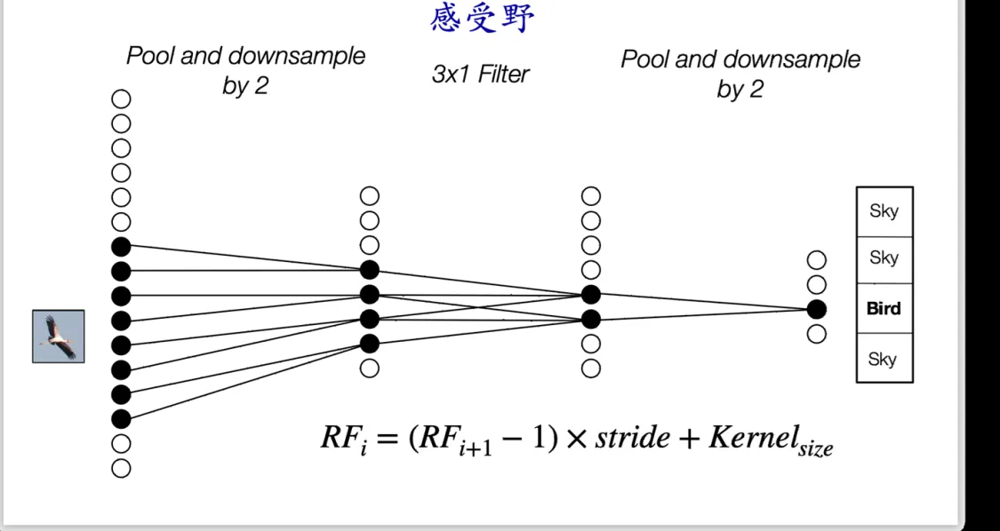

# 深度学习基础II：卷积神经网络
lecture-06主要讲解了卷积神经网络的核心思想、工作原理和CNN的应用场景、典型模型与常用数据集，本note只整理基础知识部分，应用部分回看https://www.yuque.com/wjpoom/fudan-ai/weie6089ne83p0ik#mgkKf
## CNN的核心思想
回顾上一节课的全连接神经网络，全连接神经网络适用于处理通用数据，计算复杂度高，模型参数量大，难以适应较大分辨率的输入图像

CNN的构建思路：
> 核心思想：将输入图像切割为小块，然后独立且相同地处理每个小块
1. 我们将输入图像划分为一系列小块（patch），然后使用一个分类器独立地对每一块图像进行预测
* 一般神经网络对图像输出统一的预测，而cnn对每一个块都会有独立的预测；
* cnn的输入和输出保持了相似的结构

在实际情况下，考虑两个问题：
* 若图片中的物体比块大的多怎么办？
* 若一个物体处于多个块中怎么办？
2. 改进小块的划分方式：
以每个像素为中心，划分一系列相互重叠的稠密块，将每个块的预测结果作为这个块中心像素点的预测结果

## CNN的工作原理
### 全连接网络与卷积神经网络
1. 全连接网络
全连接网络的每一个神经元都与前一层中所有的神经元相连，网络的参数量巨大，计算量大

2. 局部连接网络
每个神经元只与前一层的部分神经元相连的网络叫做局部神经网络

3. 卷积神经网络
卷积神经网络是一种特殊的局部连接网络，局部参数$w$是共享的

> 卷积神经网络的两个特点：局部连接、权重共享
### 卷积核与卷积操作
1. 上面所述的权重矩阵$w$即为卷积核(convolutional kernel)，本质上$w$是与输入图像块形状大小相同的矩阵，其中每一个元素对应了输入图像块中的每一个像素位置。
2. 卷积操作
输入图像块和卷积核之间进行加权求和
【例子】

下面对卷积操作进行一个形式化的定义：
  ○ 向量化的表示：$\textbf{z}=\textbf{w}\circ\textbf{x}+\textbf{b}$，其中$\circ$表示的是卷积操作
  ○ 计算位于$n$行$m$列的输出：$X_{\text{out}}\text{[n, m]} = b + \sum_{k,l=-N}^{N} w[k, l]X_{\text{in}}\text{[n - k, m - l]}$
  ○ 其中$w,X$分别对应了卷积核以及输入图像块
3. 滤波器
卷积核也常被称作滤波器（filter），卷积核在输入通向上滑动，并于所处的每一个图像块进行卷积操作就能够得到上图右侧的输出，可以看到经过卷积核的操作，很好地将图像的边缘信息提取出来了，同时把别的信息给过滤了。这种现象也类似是一种信号的过滤操纵。

### 卷积神经网络的特点
1. 分块操作
2. 滤波器
3. 权重共享
4. 平移不变性：$f(translate(x))=translate(f(x))$
5. 可以处理任意大小的输入
### 多通道的输入输出
在实际使用时，我们卷积层的输入和输出都会包含多个通道（channel），记通道数为c；
此时卷积核会在通道维度上进行扩展，变成一个$w\times h\times c$的矩阵；
> 卷积核的通道数和输入数据的通道数是相同的

卷积运算也会在通道上进行扩展:$y=\sum_c w_c\circ x_c$

由于单个卷积核操作后输出的通道数变成了1，我们如果想让输出中同样包含多个通道，那么可以使用多个卷积核。其中每个卷积核会独立地处理输出，并得到一个通道数为1的输出。当所有卷积核处理结束后，我们把所有卷积操作的输出在通道数上进行拼接，就能够得到多通道的输出。
> 卷积层输出的通道数等于卷积核的个数
> 

● 下面我们对多通道输入和输出的卷积操作进行总结：
  ○ 卷积核的通道数等于输入图像（特征图）的通道数
  ○ 输出特征图的通道数等于卷积核的个数
● 具体而言，第$l$层到第$l+1$层的映射可以表示为：$X_{l} \in \mathbb{R}^{H \times W \times C_{l}} \rightarrow X_{(l+1)} \in \mathbb{R}^{H \times W \times C_{(l+1)}}$
● 其中每个卷积核的参数量为$M\times N\times C_l$
● 该层的卷积核数量数量为$C_{l+1}$
下面的动图中展示了输入包含3个通道，输出包含两个通道的卷积层

### 池化操作

● 池化操作和卷积操作类似，都是对输入的一个局部区域（块）进行处理，然后对每一个局部输出一个结果
● 最常用的池化操作包括最大池化和平均池化
  ○ 最大池化（max pooling）是指从一个区域中选出最大的值作为这个区域的输出
  ○ 平均池化（mean pooling）是指对一个区域中的所有值计算平均值作为这个区域的输出
● 但是与卷积操作不同之处在于：
  ○ 卷积操作会改变输入的通道数，每个卷积核输出的通道数都为1
  ○ 池化操作不会改变输入的通道数
● 池化操作带来的一个好处是：可以减轻网络对空间变化的敏感性，这样能够让网络更加稳定（即当输入发生一些微小的变化时，不会对模型的预测带来过大的影响）。
### 降采样

● 要实现下采样，一种最常用的做法就是进行带步长的操作（strided operation），这种操作既可以是卷积操作也可以是池化操作
● 即在窗口滑动过程中，我们并不是逐像素滑动，而是每次滑动$s$个像素（$s$被称作步长），这样我们的输出就会相比于输入在空间尺寸上缩小，因此实现了降采样。

### 感受野
感受野（Receptive Feild）是指的卷积神经网络中某个神经元能够看到的输入图像中的空间范围（或者说这个神经元受到输入图像中哪些区域的影响）

//TODO 感受野的计算
