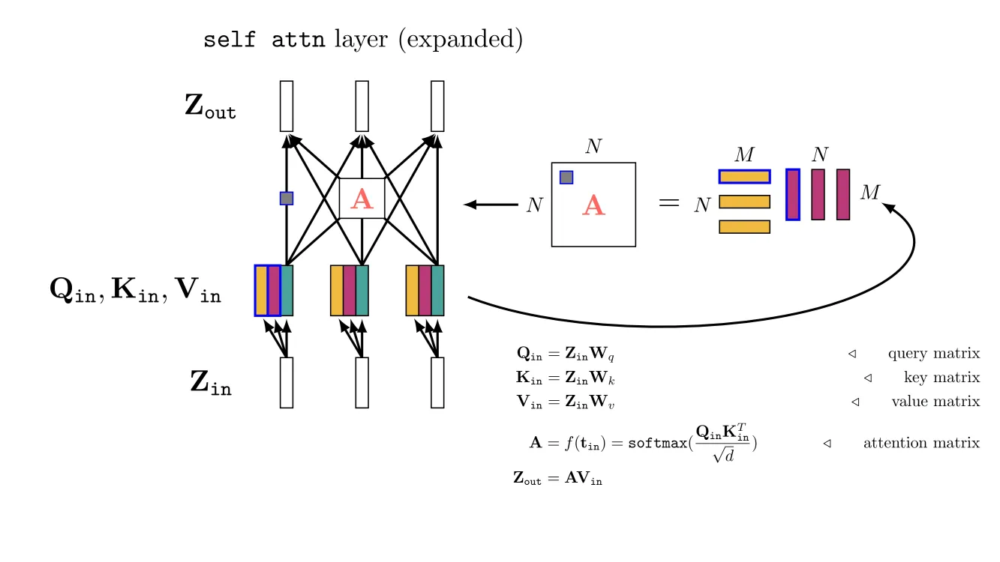
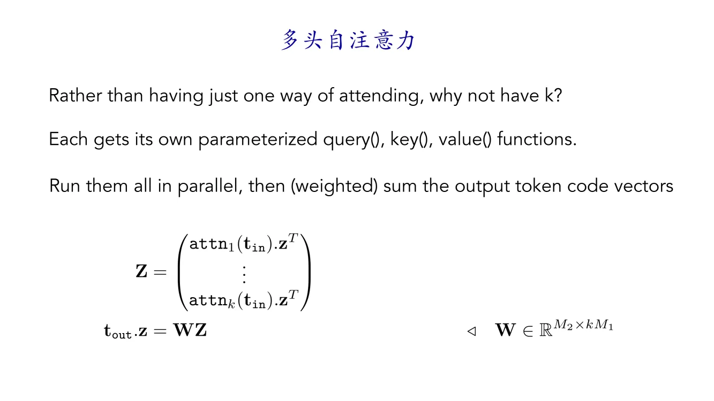
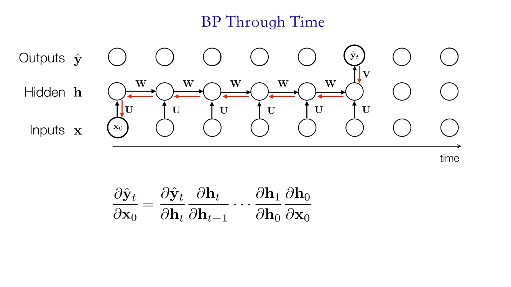

# 深度学习基础III：Transformer 及RNN
[TOC]
## Token数据结构
Token可以翻译为“令牌”，也可以翻译为“词元”。在神经网络中，每一层的神经网络会聚合上一层网络中神经元的输出，神经网络处理的对象是神经元。相比之下，Transformer所处理的对象是一批token而非神经元。

### Tokenize操作

我们可以对任意模态(modality)的数据得到相同大小的token。传统的神经网络可能会使用不同的架构处理不同模态的数据，但Transformer中使用token的思想能使我们用统一的架构处理各种模态的数据。
在获得这些token之后，一个多模态模型可以同时处理不同模态的token，去挖掘不同模态信息之间的关联，这样就能用一个统一架构去处理不同类型的任务。

对于一个单独的token，我们可以找到它其中某一点token code vector 对应到原始输入的部分。
### Token网络
#### Token的线性组合

首先比较神经网络和Transformer在聚合神经元/信息过程中的不同：
* 神经网络：聚合前一层神经元的输出到下一层的某一个神经元
* Transformer：聚合多个token的信息到一个token，处理单元从神经元变成了token
#### Token-wise 非线性

除了聚合多个token的信息到单独的token，Transformer一般还会对每个单独的token做一个非线性的映射$F_{\theta}$。一般来说，$F_{\theta}$是一个MLP（多层感知机）。
类比于CNN：
* 当某一个卷积层的kernel大小大于1，那么这一层在处理某一个像素时会考虑周围的区域，这就类似于上述的token的线性组合
* 当kernel大小为1时，该层只处理单个像素，$F_{\theta}$的作用类似于kernel大小为1的卷积层，独立计算每一个token。

对于一个完整的Token网络，我们会层次化地堆叠两种类型的网络：
* 聚合多个token的信息到某个token，从而建模不同token之间的关系
* Token-wise操作，只对单独的token做计算
## 注意力机制
首先考虑CNN的局限性：
CNN使用卷积层处理图像，计算过程中使用固定大小的卷积核在图像上滑动，感受野的大小取决于卷积核的大小，感受野是局部的。而增大卷积核会导致参数量、计算量的快速增长。
下面介绍视觉中的注意力机制：
假定我们有一个查询(Query)，对于这些查询，我们只需要关注图像中的一部分信息。
> 注意力的思想就是只关注图像中和查询关联度最高的信息。

为了完成这种注意力的计算，我们依然可以以图像块为单元，使用卷积网络处理这些图像块，从而实现空间信息的聚合。有以下四种聚合方式，这四种方式每一层的卷积层都参数共享（即使用相同的卷积核去处理每一个图像块）：
● 卷积在滑窗时在不同图像块之间没有重叠，卷积核在处理每一个图像块时看不到其他图像块的信息。
● 卷积在滑窗时在不同图像块之间有重叠，卷积核在处理每一个图像块时可以看到其他图像块的信息。
● 层次化的方式进行聚合。越靠上的层覆盖更大的图像面积。
● 使用全连接网络进行聚合。

### Attention的计算
Transformer中提出了注意力层，通过计算不同token之间的相似度来挖掘它们之间的关联程度。
对于全连接层，在计算时有$Z_{out}=WZ_{in}$，其中$W$是训练得到的参数，它并不取决于$Z_{in}$。
相比，对于注意力层，在计算时$Z_{out}=AZ_{in}$，而$A$是$Z_{in}$中各个token之间的相似度，而非通过训练固定下来的参数。因此注意力层根据你的输入信息得到$A$，如果某两个token相似度很高，那么它们彼此之间会有更高的权重。相比于全连接层，注意力层更加取决于数据，对数据做了更少的先验假设。

#### Query-key-value Attention 与 Self-Attention
首先介绍QKV注意力：
* Query：查询
* Key：对于一个输入Q，Q中的各个token会与K中的token做匹配，计算相似度得到注意力权重。
* Value：使用注意力权重对V中的元素进行加权，加权得到的就是最后的输出。
假设我们现在有一个查询token：$t_{question}$，以及一系列图像patch token：$z=\begin{pmatrix}t_1^T\\ \vdots \\ t_n^T \end{pmatrix}$。
QKV注意力的计算流程如下：
1. 对Q、K、V分别做线性变换：
$$Q_{in}=W_qt_{question}=q^T_{question},K_{in}=W_kz=\begin{bmatrix}k_1^T\\ \ldots  \\ k^T_n \\\end{bmatrix},V_{in}=W_zz=\begin{bmatrix} v_1^T\\ \ldots \\ v_n^T \\\end{bmatrix}$$
2. 计算$Q_{in},K_{in}$之间的余弦相似度$s=\begin{pmatrix}q_{question}^Tk_1, \cdots q_{question}^Tk_n\end{pmatrix}$
3. 使用softmax处理余弦相似度，得到权重$A=softmax(s)$
4. 利用权重对$V_{in}$加权，得到最后输出$Z_{out}=AV_{in}$。

下面介绍自注意力：
简单来说，自注意力中的QKV来源都相同，即计算自己和自己的相似度，通过挖掘某一个图像块和周围其他图像块的相似关系来提升其本身特征的质量。

下面是一个相似度矩阵的例子，白色表示相似度大（1），黑色表示相似度低（0）。一个图像块和它自己本身完全相同，因此相似度最大。

若是全连接层，那么矩阵$W$在推理过程中固定不变。
若是自注意力层，我们先使用一个$f$映射(通常是一个线性层)，将某一个token映射为三份：$q_i=f_q(t_i), k_i=f_k(t_i),v_i=f_v(t_i)$
在之前的例子中，我们可以看到相似度矩阵中的对角线永远是最大，这样会导致模型难以从数据中学到更有用的信息。因此我们用这种映射打破这个规律，促使模型学到更有用的信息。

令$N$是token的数量，由于QKV来源相同的一组token，因此QKV三者的token数量均为$N$。
令$M$是token向量的维数，$Q_{in}$大小为$N\times M$，即包括N个token
计算流程如下：
1. 使用线性变换将某个token映射为QKV三份
2. 计算余弦相似度$Q_{in}K^T_{in}$。对于该矩阵的第一行第一列的元素（灰色方块），它的值为$q_{1}k_{1}^T$，即第一个Q向量和第一个K向量的点乘。
3. 在softmax之前，将相似度做维度的放缩（$d,M$含义相同，都表示token向量的维度），使计算过程更具稳定性。
4. softmax、加权得到结果。这两步和之前相同。

#### 完整的Transformer网络
为了使特征从最开始的底层纹理、颜色信息转化为最后能供分类的高层语义，Transformer模型不断堆叠以下的层：
● 卷积/线性层：将单个token转化为QKV三组供注意力计算；对token单独编码。
● 注意力层：聚合不同token之间的信息。

#### 排列不变性
Transformer的一个特性是排列不变性，即我们改变token之间的相对位置不影响该token最后的输出。
从图中可以看到，蓝色的token永远会变成粉色的token。这是因为重新排列$Q_{in},K_{in}$，只会影响$Q_{in}K^T_{in}$中元素的位置，而不会影响它们的值。

#### 多头自注意力
原来只有一组QKV，但我们现在在线性变换时计算k组QKV。对每一个头的QKV进行单独计算处理。最后加权得到结果。对于这么做的原因有两种解释：
● 更多的头意味着更多参数，更多参数提升网络性能。
● 不同的头中模型能够关注不同的信息，从而使表达能力更加丰富。

## 位置编码
我们知道卷积有平移不变性，有时候我们不想要平移不变性：
> 假设有一个很长的句子：“今天天气很好，……省略100字……，Transformer是很好的模型”。如果没有位置信息，前面一个“好”和后面一个“好”在注意力计算时可能会有很高的相似度，尽管它们之间并没有任何关联。但如果有额外的信息可以帮助模型区分这两个“好”所在的位置，那么它们之间的相似度会减弱，模型能够关注到更有价值的东西。

可以通过以下方式去除平移不变性：
1. 使用MLP这类不具有平移不变性的模型。
2. 将位置信息加到输入中，这样卷积核在滑动到不同的位置时会根据额外的位置信息产生不同的输出。

一种使用较为广泛的位置信息是**Sinusoidal positional embeddings (Fourier positional codes)**：
计算时使用sin、cos函数来给每一个位置分配一个值作为位置编码。由于图像有长宽两个维度，我们从横向、纵向两个方向来进行编码。最后对红色框这个patch，我们结合两个方向的sin函数输出得到一个长度和token维度数相同的位置编码向量：

具体计算流程可以参考下图，假设有一句句子包含四个单词，每个单词向量的维度数量为d。我们需要填充这个$4\times d$大小的矩阵作为位置编码，利用sin、cos周期函数来给上述矩阵的每一个位置填上值：

最后的位置编码矩阵如下图所示：

## 序列模型
生活中有很多时间序列数据：视频、句子、音频……在Transformer出现之前，处理这种时间序列数据，我们一般使用RNN、LSTM这类模型。
### 时间序列上的卷积
一种时序建模的方式是在时间上做卷积。
1. 例如我们将视频的每一帧映射为一个向量，我们使用一个卷积核大小为3的一维卷积层去在这些帧上滑动。卷积核每次能够看到前后三帧的信息。这样的作法的缺点是：可能会忽略空间上的信息，因为我们将二维的图像信息压缩成了一维向量。

2. 相比之下，我们可以用3D卷积去处理一个大小为$H\times W \times T$的视频，这样就可以捕捉到空间上的信息。但是这样做的问题是难以捕捉到长序的依赖关系。
3. 为了解决卷积的这个问题，我们模仿人的认知过程引入记忆单元。比如我们可以将早上的帧的特征存储在这个记忆单元中，到晚上把新的特征和记忆单元作比较。

### RNN
RNN的做法就是将历史的信息存储在隐藏状态中，通过不断复用隐藏状态来完成时序上的建模。

#### RNN的前向传播
RNN一次前向传播需要输出两个东西：
● $h_t$当前的隐藏状态，由当前的输入和前一时刻的隐藏状态决定。
● $y_t$模型的输出。可以是句子的单词、视频的一帧、……。

如果要使用多层RNN，此时每一层的某个隐藏状态由纵向（处理输入）、横向（处理前面历史时刻的隐藏状态）的两组权重计算得到。

#### RNN的反向传播
1. 假设要进行反向传播，求t时刻的输出对0时刻的输入的梯度，那么我们需要对每一个时刻的隐藏状态进行求导

2. 由于不同时刻的隐藏状态使用同一组权重$W$进行计算（权重共享），在最后反向传播时需要将所有时刻的梯度累加起来更新$W$

下面这个图详细计算了$J=\sum_{t=o}^TL(\hat{y_t},y_t)$对$W$的梯度。

#### RNN的问题
● 模型消耗的内存随着时间序列长度的增加而增加
● 马尔可夫假设，后一个隐藏状态只和前一个隐藏状态相关，但这个假设可能导致模型的建模能力不足。
● 记忆信息的工作都只由$W$完成，表达能力并不充分。
● 如果上下文长度非常长，旧的状态可能会被遗忘。并且这种结构对长序依赖的建模并不是很友好。
● 由于反向传播过程中每个状态的梯度通过乘法累积，可能会导致梯度消失/梯度爆炸的问题，导致优化十分困难。
### LSTM
LSTM的提出就是为了解决RNN的这些问题，LSTM通过更多可学习的组件来处理RNN中长序列遗忘的问题。

上图是LSTM的结构，有以下几个关键的部分：
● **记忆单元**（Cell State）$C_t$：LSTM除了有RNN中的隐藏状态$h_t$，还通过这个记忆单元来存储和访问信息，并通过门控机制来控制信息的遗忘/记忆。
● **遗忘门**：LSTM 的第一步是决定我们需要从cell状态$C_t$中扔掉什么样的信息。这个决策由一个称为遗忘门的sigmoid层决定。

● **输入门**：决定我们需要在cell状态中存储什么样的信息。

● **输出门**：决定要输出的东西。

### 自回归模型
自回归模型的核心在于：在训练过程中，我们人为遮掉某一个/最后一个单词，让模型预测被遮掉的部分是什么。这样在模型看到大量的数据后可以学习到单词之间的关联关系。
在训练和推理过程中，模型的目标都是去预测下一个单词是什么：

下面是自回归模型的条件概率的描述：$x_1,...x_n$是句子的n个单词，$X$是整句句子：

在实际实现过程中，我们使用一个分类器来预测下一个词。为了实现这个分类器：
* 一种做法是设计一个很大的词表：词表里面总共有十万个单词（表示十万个类别），我们在分类时需要去预测下一个单词在这十万个单词中的概率分布；
* 另外一种做法是只去预测二十六个字母，这样此表的大小为缩小很多。但是这样一个单词就表示为一系列字母的组合，我们在预测时可能要去预测单词的开始/结束标志。
## 序列建模小结
本章节中介绍了三种时间序列建模的方式：
1. RNN、LSTM类型的循环神经网络。权重在不同时刻共享，权重由模型本身决定，推理时不随数据变化而变化。
2. 卷积网络。权重在不同时刻共享，权重由模型本身决定，推理时不随数据变化而变化。
3. 注意力机制，权重由推理时模型看到的数据决定。

在序列建模中，我们可以根据输入/输出序列的长度来对这些任务进行分类：
● 一对一：一般的分类/回归任务
● 一对多：图像描述（一张图片->多个单词）
● 多对一：句子分类/多项选择问答（多个单词->一个单词）
● 多对多：机器翻译/视频描述/问答（多张图片/多个单词->多个单词）
