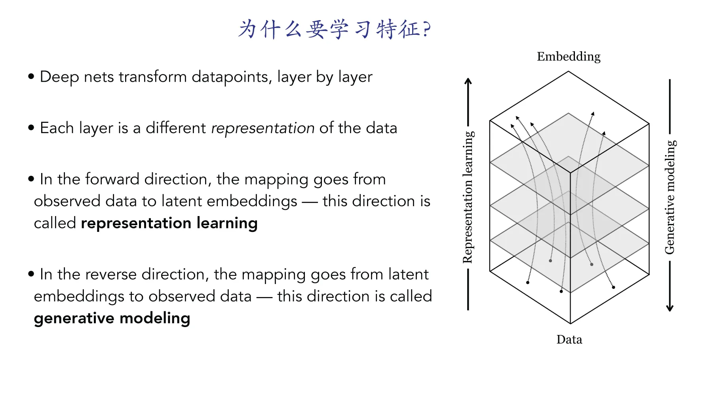
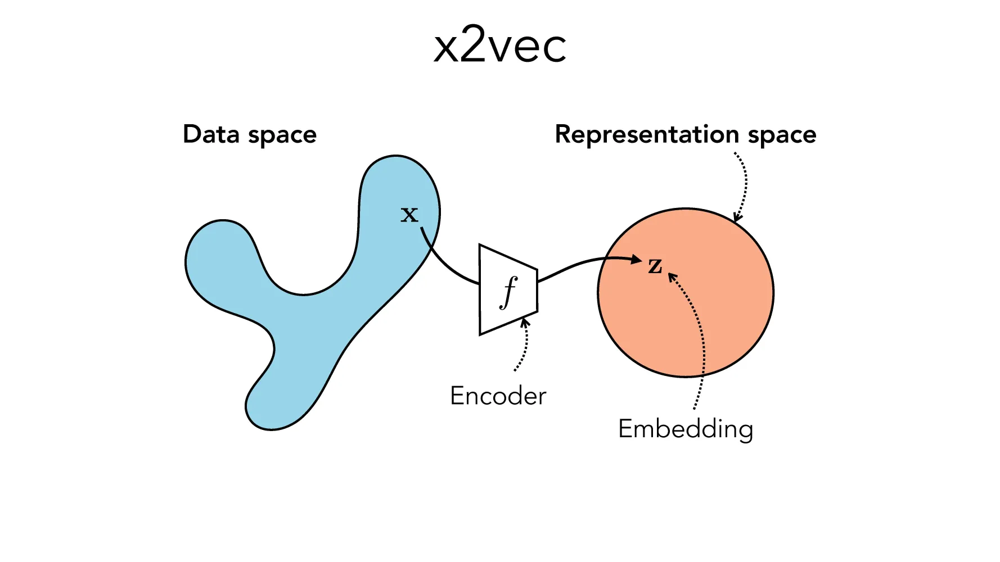
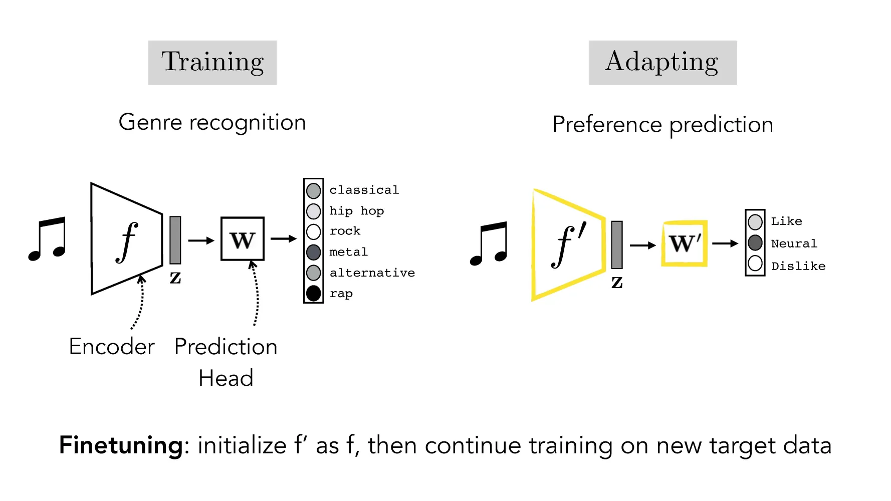
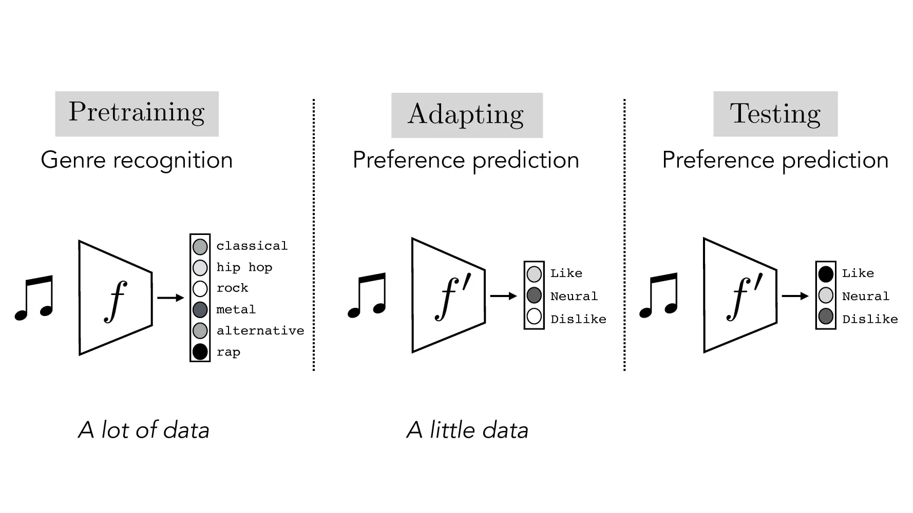
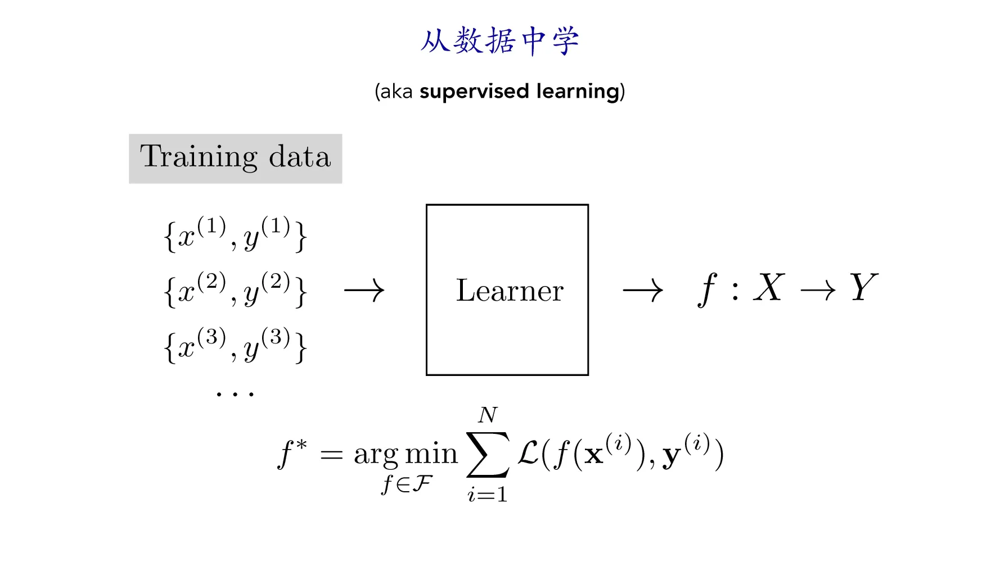
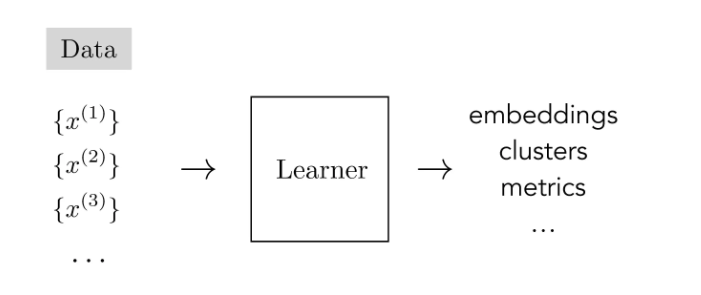
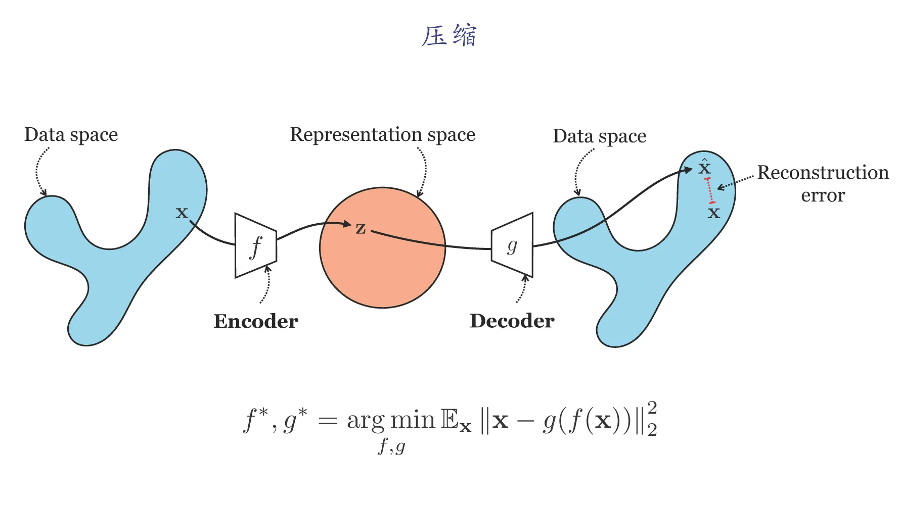
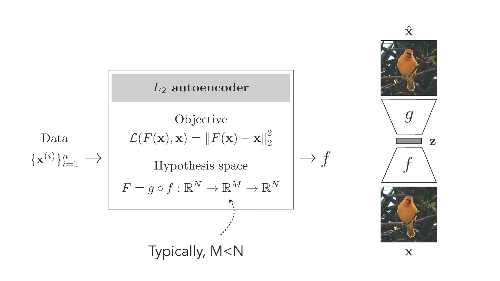
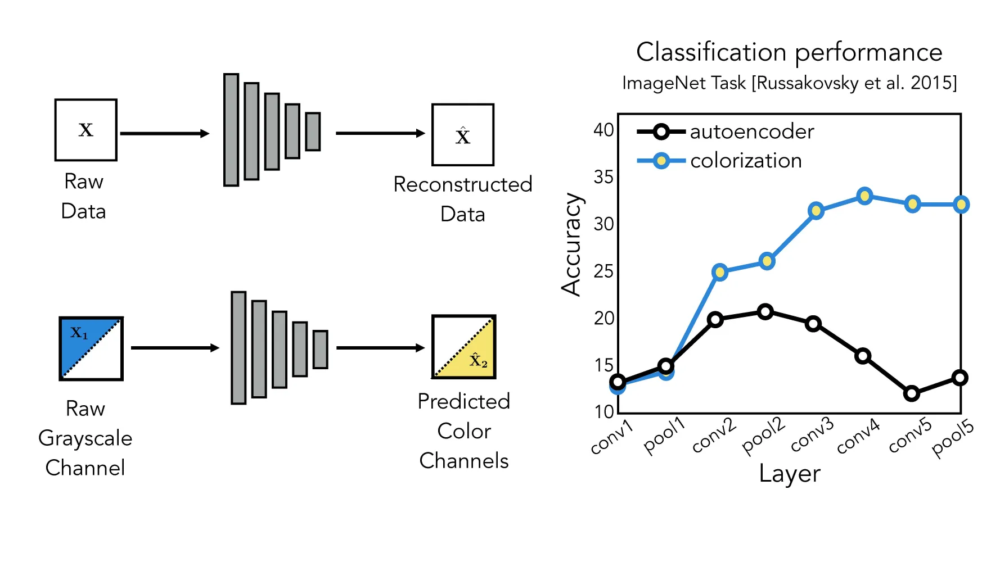

# 表征学习
[TOC]
## 特征学习的定义
深度网络可以看成对数据点进行逐层的映射，每一层都是数据不同的表示
* 在前向中，映射从浅层到深层将原始数据转换为隐式嵌入，用隐空间的向量来表示每一个数据。这个方向的映射称为**特征学习**
* 在反向中，映射将隐空间的数据嵌入映射回观测的数据，可以理解为由隐空间的向量生成观测的数据，这个方向的映射称为**生成式建模**

神经网络的学习可以看作一个 x2vec 的过程
○ x：输入数据
○ 2：to
○ vec：向量/特征
每一层的输出都是一个特征，每一层的特征都可以称为**Embedding**

## 为什么要学习特征
在实际应用中，我们通常会碰到这样一种情况：模型在测试时需要处理的任务和训练时的任务是不太一样的，大致有2种方式可以解决这个问题：
1.  **linear adaptation(linear probing)**
● 固定模型提取特征网络层的参数，只在新的数据集上对最后一层线性层的参数进行训练
● 在这种情况下，默认模型已经通过上一个任务学习到了数据（如音乐音频）比较好的特征，该特征可以直接应用于下一个任务

2. **微调（finetuning）**
对模型的所有参数进行训练，而不只是训练最后一个线性层
3. **两种方式的应用场景**
○ 当新任务的数据集比较小时，通常会使用 linear probing
○ 当新任务的数据集比较大时，通常会使用 finetuning
○ 可以这样理解：只有数据集足够大才能支撑整个模型参数的微调，否则很容易出现过拟合现象，所以我们采用 linear probing；同理，当数据集较大时，如果直接使用linear probbing，由于可微调的参数较少，则会出现欠拟合现象，微调效果通常不好

总结一下，整个过程就是**预训练-微调-测试**的过程。在这个过程中，我们希望模型在预训练阶段能学到比较好的特征$z$，使其能适应不同种类的下游任务

步骤如下：
   ○ 模型在任务A上训练时，得到了一组参数$W$和$b$
   ○ 随后我们用这组参数中的一部分或全部，去初始化第二个具有同样结构的网络的参数
   ○ 我们用初始化后的第二个网络在任务B上训练，得到新的参数$W^{\prime}$和$b^{\prime}$
● 学习到的特征表达实际上是特征提取器，在微调时encoder和linear层都需要被调整
## 学习特征的方式
深度学习三巨头之一、图灵奖得主 Bengio 认为，好的特征应该：	
1. 足够小、足够紧致
2. 能够充分地对原始数据的性质进行表示
3. 解耦合
   * 特征的不同部分负责数据不同种类的性质
4. 可解释性要好
5. 让后续的任务求解变得更加容易
### 有监督学习
给定数据$X$及其标签$Y$，让模型去拟合一个从$X$到$Y$的映射（函数）
优化目标是$f^*=\mathop{\arg\min}\limits_{f\in\mathcal{F}} {\sum_{i=1}^{N}{\mathcal{L}(f(\mathbf{x}^{(i)}), \mathbf{y}^{(i)})}}$
* $f(\mathbf{x}^{(i)})$是网络的输出
* $\mathcal{L}$是损失函数

### 无监督学习
无监督学习：从数据本身中学习特征；只利用数据本身进行训练，而没有数据对应的标签
● 为什么用无监督学习？
  ○ 收集标签$Y$可能是费时费力的
● 进一步，可以划分为无监督学习和强化学习
  ○ 无监督学习：从数据中学习
  ○ 强化学习：从环境中学习

#### 自监督学习
自监督学习(self-supervised learning)是无监督学习的一种：自监督学习希望人为地从数据中创造“标签”，“聪明的”从数据中找到监督信号（如学习数据点的嵌入、聚类或其他特征）。自监督学习到的特征是有意义的

自监督学习包括**压缩**和**预测**两大类
##### 压缩
压缩将输入数据（如图像）编码到一个向量空间中，并希望编码后的向量能够对该数据进行重建
>   核心思想：给定一张图像，如果网络学习到很好的特征，那么可以根据该特征将图像还原出来

一个比较典型的压缩方法是**自编码器**，自编码器包括编码和解码两部分
* **编码**（encoding）：将输入图像映射到合适的向量空间中
* **解码**（decoding）：根据编码得到的向量，重新生成原图像
经过自监督训练，模型的编码器和解码器都学习到了原数据分布的有用的信息

自编码器的优化目标是$\mathcal{L}(F(\mathbf{x}), \mathbf{x})=\left\Vert F(\mathbf{x}) - \mathbf{x} \right\Vert_2^2$ ，其中$F=g \circ f$，该函数将数据从$\mathbb R^N$映射到$\mathbb R^M$，再映射回$\mathbb R^N$
自编码器训练完成后，我们一般会将编码器$f$重复利用，应用于其他的下游任务；解码器$g$会被丢弃
前我们提到，在特征学习中，我们希望学习到好的特征$\mathbf z$，使其能应用在不同的任务上面；在这里，自编码器的编码器就学习到了一种好的特征 $f(\mathbf x)$，能利用它进行数据的重构一般来说，自编码器中的$M$会小于$N$，如$M=64, N=224*224*3$
  ○ 因为我们需要用更少的特征去表达原数据，才能实现数据的压缩

##### 预测
在自监督学习中，我们希望模型能够**根据数据的一部分预测数据的另一部分**。若模型能够很好的进行未知数据的预测，说明模型已经提取到很好的数据特征。
数据的一部分可以是这些层面的：空间层面、时序层面、维度层面
#### 对比压缩和预测
对比一下两种自监督任务的训练对于下游任务（如分类）的影响：
* 左图上半部分是对图像数据进行重建
* 左图下半部分是根据灰度图对色彩空间进行预测
* 右图是两种训练方式提取的特征对于分类任务的准确率比较

