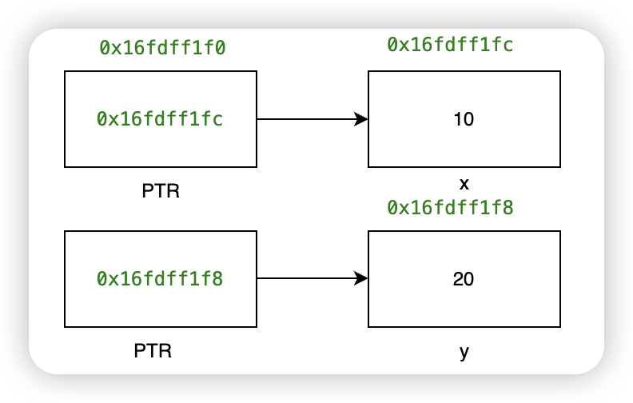
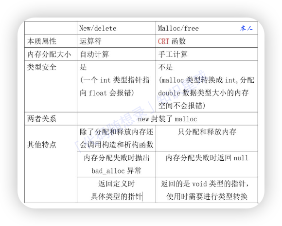
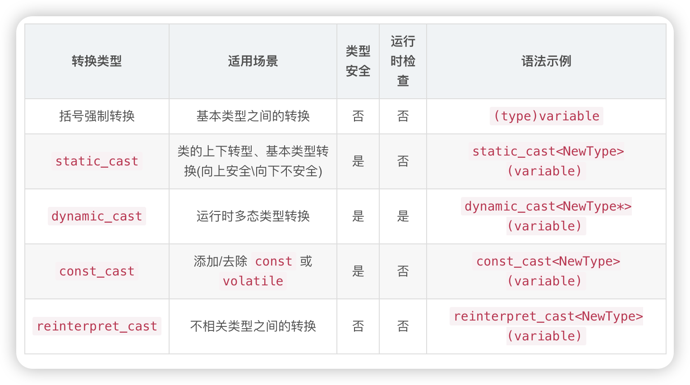

# C++基础
[TOC]
## 指针与引用
- 指针本身是变量，存放某个对象的地址
- 引用是变量的别名，不可变，必须初始化

```C++{.line-numbers}
int main(){
    int x = 10, y = 20;
    int *ptr;
    int &ref = x;//引用必须初始化
    ptr = &x;//ptr存放x的地址
    cout << "ptr的地址是 " << &ptr << endl;//0x16fdff1f0
    cout << "ptr的内容是 " << ptr << endl;//0x16fdff1fc
    cout << "x的地址是 " << &x <<endl;//0x16fdff1fc
    cout << "ptr指向的内容是 " << *ptr << endl;//10
    *ptr = 100;
    cout << "x的值为 " << x << endl;//100
    ptr = &y;
    cout << "ptr的地址是 " << &ptr << endl;//0x16fdff1f0
    cout << "ptr的内容是 " << ptr << endl;//0x16fdff1f8
    cout << "y的地址是 " << &y <<endl;//0x16fdff1f8
    cout << "ptr指向的内容是 " << *ptr << endl;//20
}
```

```C++{.line-numbers}
int main(){
    int x = 10, y = 20;
    // int &ref;报错
    int &ref = x;//引用必须初始化
    cout << "x的地址是 " << &x << endl;//0x16fdff1fc
    cout << "ref的地址是 " << &ref << endl;//0x16fdff1fc
    cout << "ref的值是 " << ref << endl;//10
    ref = y;
    cout << "x的值是 " << x << endl;//20
    //&ref = y;报错，引用的对象不可更改
}
```
用途：
- 指针： 通常用于动态内存分配、数组操作以及函数参数传递。
- 引用： 通常用于函数参数传递、操作符重载以及创建别名。
## 数据类型
- 数据类型的长度
$short(至少16位) \leq int \leq long(至少32位) \leq longlong$ 
- 计算数据类型的大小
```C++
int main(){
    cout << "short is " << sizeof(short) << " bytes.\n";//2
    cout << "int is " << sizeof(int) << " bytes.\n";//4
    cout << "long is " << sizeof(long) << " bytes.\n";//8
    cout << "long long is " << sizeof(long long) << " bytes.\n";//8
}
```
- 符号常量 引入头文件<climits>
```C++
#include<iostream>
#include<climits>

using namespace std;

int main(){
    cout << "INT_MAX is " << INT_MAX << endl;//2147483647
    cout << "INT_MIN is " << INT_MIN << endl;//-2147483648
}
```
## 关键字
### const关键字
1. 普通变量
`const`修饰的变量的value不可变的
```C++
int main(){
    const int a = 10;
    //a = 20;报错，a 被 const 修饰，不能修改
    //int *p = &a;报错
}
```
2. 修饰数组
数组内元素不可修改
```C++
int main(){
    const int arr[5] = {0};
}
```
3. 常量指针
强调指针指向的对象不可更改，即不可以通过常量指针来改变常量，但是可以更改指针指向的对象
`const int* a = &temp;`
`int const *a = &temp;`
```C++
int main(){
    int temp = 10, temp1 = 40;
    const int* a = &temp;
    cout << "a的地址是 " << &a << endl;//0x16fa6f280
    cout << "a的内容是 " << a << endl;//0x16fa6f28c
    cout << "a指向的对象是 " << *a << endl;//10
    //*a = 20; 报错，不能通过改变常量指针来改变对象
    temp = 20;
    cout << "a指向的对象是 " << *a << endl;//20
    //a指向的对象可以改变
    a = &temp1;
    cout << "a的地址是 " << &a << endl;//0x16fa6f280
    cout << "a的内容是 " << a << endl;//0x16fa6f288
    cout << "a指向的对象是 " << *a << endl;//40
}
```
4. 指针常量
强调指针指向的对象不可更改，但是可以通过指针改变对象的值
`int* const a = &temp;`
```C++
int main(){
    int temp = 10, temp1 = 40;
    int* const a = &temp; 
    cout << "a的地址是 " << &a << endl;//0x16fa6f280
    cout << "a的内容是 " << a << endl;//0x16fa6f28c
    cout << "temp的地址是 " << &temp << endl;//0x16b1cf28c
    cout << "a指向的对象是 " << *a << endl;//10

    *a = 20;
    cout << "temp的值是 " << temp << endl;//20

    //a = &temp1;报错，a指向的对象不可以改变
}
```
5. 函数形参
5.1. 修饰指针形参
`const`修饰指针形参，表示无法通过指针修改其所指向的外部实参。
```C++
void function(const Char* Var);
```
5.2. 修饰引用形参
在这种情况下，参数为引用，将外部实参传递给引用实参，传递的是外部实参本身，无需进行拷贝。同时，使用`const`引用，无法通过引用修改实参。
```C++
void function(const int& p);
```
6. 函数返回值
表示`function`函数返回的是一个指向`const int`类型的指针，这表明函数返回的指针指向的是一个不可修改的`int`变量，可以防止通过返回的指针修改数据。
```C++
const int* function();
```
7. 成员变量
```C++
#include<iostream>
using namespace std;

class student{
    public:
    const int id;
    student() : id(10){}//只能在初始化列表中赋值
};
class people{
    public:
    const int num = 10;//C++11特性，可以直接赋值
};

int main(){
    student A;
    //cout << student::id << endl;报错，不可以直接用类名调用
    cout << A.id << endl;
    people B;
    cout << B.num << endl;
}
```
8. 成员函数
`const`修饰成员函数表示该函数不会修改类的成员变量，即函数内部不会更改对象的状态。具体来说，`const`成员函数只能读取成员变量的值，而不能对其进行修改（除非该成员变量是用 `mutable`关键字声明的）
```C++
#include<iostream>
using namespace std;

class student{
    public:
    int id ;
    student():id(10){};
    const int getvalue(){
        return id;
    }
};

int main(){
    student A;
    cout << A.getvalue() << endl;
}
```
### static关键字
`static`关键字主要用于控制变量及函数的生命周期、作用域以及访问权限。
1. 静态变量
- 在函数内部用`static`关键字修饰的变量称为静态变量
- 静态变量在程序中的整个生命周期内存在，不会因为离开作用域而销毁
- 静态变量可以被用来记录函数调用的次数
```C++
#include<iostream>
using namespace std;

void CountAdd(){
    static int count;//静态变量初始化默认为0
    count ++;
    cout << "count的值是 " << count << endl;
}

int main(){
    CountAdd();//1
    CountAdd();//2
}
```

2. 静态函数
在函数前加`static`关键字，静态函数只能被本文件调用，不能被程序中其他文件调用，所以其他文件可以定义同名的函数
```C++
#include<iostream>
using namespace std;

static void examplefunction(){
    cout << "Function" << endl;
}

int main(){
    examplefunction();//Function
}
```

3. 静态成员变量
- 静态成员变量是在类里声明变量，在数据类型前添加`static`关键字。
- 静态成员变量只能在类外单独定义，以便给它分配存储空间
- 所有类的对象都可以调用静态成员变量，直接使用类名也可以调用
```C++
#include<iostream>
using namespace std;

class example{
public:
    static int examplemember;//在类内声明静态成员变量
};
int example::examplemember = 10;//在类外定义静态成员变量

int main(){
    example classA, classB;
    cout << classA.examplemember << endl;//10
    cout << example::examplemember << endl;//10
    classB.examplemember = 20;
    cout << classB.examplemember << endl;//20
    example::examplemember = 30;
    cout << example::examplemember << endl;//30
}
```
4. 静态成员函数
- 在类内部使用 `static`关键字修饰的函数是静态成员函数
- 静态成员函数不能直接访问非静态成员函数或非静态成员变量
- 可以直接使用类名调用
```C++
class example{
public:
    static void ExampleFunction(){
        cout << "function" << endl;
    }
    static void ExampleFunction2(){
        static int temp = 1;
        int num = 100;
        cout << "temp is " << temp << endl;
        temp++;
        num ++;
        cout << "num is " << num << endl;
    }
};
int main(){
    example::ExampleFunction();//function
    example::ExampleFunction2();//temp is 1 num is 101
    example::ExampleFunction2();//temp is 2 num is 101
}
```
```C++
static void ExampleFunction(){
        static int temp = 1;
        cout << "temp is " << temp << endl;
        temp++;
    }

int main(){
    ExampleFunction();//temp is 1 
    ExampleFunction();//temp is 2 
    //temp = 10;报错，不能直接调用
    int temp = 9999;
    cout << "temp is " << temp << endl;//temp is 9999
}
```
### constexpr关键字
`constexpr`是C++11引入的新关键字，用于定义常量表达式，其值在编译阶段确定，而`const`的值可以在运行时确定。一个`constexpr`的变量和函数一定是`const`，但是反过来不一定成立。
#### 修饰变量
声明一个编译时常量，其值必须在编译时确定
```C++
int main(){
    constexpr int x = 2*3;
    //constexpr int size = get_size();get_size()不是常量表达式
}
```
#### 修饰函数
声明一个函数在编译时就能确定返回值，这要求函数体内只能有简单的计算，不能包含任何运行时才能确定的操作(如输入输出、动态内存分配等)
```C++
constexpr int square(int n){
    return n*n;
}
```
### define关键字
`#define`是预处理指令，用于定义宏。宏是一种预处理器的规则，用来替换代码中的特定文本序列
```C++
#define PI 3.14 //定义常量
#define SQUARE(x) ((x)*(x)) //定义简单的函数宏
#define MIN(X,Y) ((X)<(Y))?(X):(Y) //定义带参数的宏
```
注意：在C++中，更推荐使用const或inline函数替代宏定义。因为const常量有类型，而宏没有，这可能导致编译时的类型安全问题。而使用inline函数可以避免宏的某些副作用，例如宏的含义可能会透支，而且inline函数有作为正常函数那样的作用域规则。
### inline关键字
`inline`函数被认为是内联函数，编译器会尝试在调用这个函数的地方直接插入函数体的代码，而不是常规的函数调用，减少了压栈，跳转和返回的操作。
1. 内联函数的定义必须在使用它的每个源文件中都可见，为了实现这一点，通常内联函数的定义会放在头文件中。
2. 不能存在任何形式的循环语句，不能存在过多的条件判断语句
```C++
// 头文件 MyHeader.h
class MyClass{
    public:
        inline int add(int a,int b) {return a+b;}
};
// 源文件 MySource.cpp
#include"MyHeader.h"

int main(){
    MyClass myClass;
    int result = myClass.add(3,4);
}
```
### typedef关键字
`typedef`用于为数据类型定义别名
1. 为基本数据类型定义别名
```C++
typedef int MyInt;
```
2. 为自定义数据类型定义别名
```C++
typedef struct{
    int x;
    int y;
} Point;
```
3. 为指针定义别名
```C++
typedef int* pInt;
```
4. 为函数指针定义别名
```C++
typedef bool (*FuncPtr)(int);
```
5. 为模版定义别名
```C++
typedef std::vector<int> IntVector;
```
6. 为枚举类型定义别名
```C++
typedef enum{
    RED,
    GREEN,
    BLUE
} Color;
```
### new关键字
`new`动态分配内存，开辟的空间存储在堆上，而我们定义的变量存储在栈上。`new`分配的空间使用`delete`释放
```C++
int* pi = new int(5);
int* pa = new int[5];
```
### volatile关键字
指令关键字，确保本条指令不会因编译器的优化而省略，且要求每次直接读值，保证对特殊地址的稳定访问
```C++
for(volatile int i = 0; i < 100000; i++);
```
### extern关键字
`extern`表明全局变量或者函数作用范围（可见性）的关键字，编译器收到extern通知，则其声明的变量或者函数可以在本模块或者其他模块使用
标准定义使用extern关键字的步骤为：
1. 定义一个.h文件用来声明需要提供外部访问的变量或者函数
```C++
//module1.h
extern int _a;
extern int _b;
int maxAB(int a, int b);
```
2. 定义一个.cpp文件来初始化全局变量或者函数的实现
```C++ 
//module1.cpp
#include "module1.h"

int _a = 100; int _b = 200;

int maxAB(int x, int y) { return x > y ? x : y; }
```
3. 在需要使用到的地方使用extern关键字修饰。
```C++
//main.cpp 
extern int _a; 
extern int _b; 
int maxAB(int a,int b);
int main() {
    cout << "a:" << _a << " b:" << _b << endl; cout << maxAB(100,200) << endl;
}
```
### struct关键字
1. 声明结构体
结构体的声明通常放在头文件或者全局命名空间中，以便在多个地方都可以使用。
在结构体中，你可以定义多种不同类型的成员变量，这些变量称为数据成员。成员可以是基本数据类型、自定义的结构体、指针、数组等。
```C++
struct Rectangle{
    int width;
    int height;
};
struct people{
    string name;
    int age;
    double grades[5];
    Rectangle rec;
};
```
2. 结构体实例化
```C++
people personA;
personA.age = 35;
```
3.成员函数
成员函数在结构体内部声明和定义，可以访问结构体的数据成员。
```C++
struct Circle {
    double radius;

    double calculateArea() {
        return 3.14 * radius * radius;
    }
};
```
C++11引入了结构体成员的访问控制修饰符（public、private、protected），允许你控制成员的访问权限。默认情况下，C++中的结构体成员是public的，但你也可以显式地指定不同的访问权限。
TODO class关键字
### class关键字
### const和define的区别
const用于定义常量；而define用于定义宏，而宏也可以用于定义常量。都用于常量定义时，它们的区别有：
1.  const生效于编译的阶段；define生效于预处理阶段。
2.  const定义的常量，在C语言中是存储在内存中、需要额外的内存空间的；define定义的常量，运行时是直接
的操作数，并不会存放在内存中。
3.  const定义的常量是带类型的；define定义的常量不带类型。因此define定义的常量不利于类型检查。
### new和malloc的区别
`new`是C++的运算符，`malloc`/`free`是c语言的函数
`new`申请内存分配时无需指定内存块的大小，而`malloc`需要显式地指出所需内存的尺寸。

### struct和class的区别
## 函数指针与指针函数
函数指针是指向函数的指针变量，可以用于存储函数的地址，允许在运行时动态选择要调用的函数
```C++
int add(int a,int b){return a+b;}
int substract(int a,int b){return a-b;}

int main(){
    //返回类型(*指针变量名)(参数列表)
    int(*operationPtr)(int,int);

    operationPtr = &add;
    int result = operationPtr(10,5);

    operationPtr = &substract;
    result = operationPtr(10,5);
}
```
指针函数是一个返回指针类型的函数，用于返回指向某种类型的数据的指针。
```C++
int* getPointer(){
    int x = 10;
    return &x;
}
```
## 局部变量与全局变量
- 静态局部变量用于在函数调用之间保留变量的值。
- 全局变量适用于多个函数需要共享的数据。
- 局部变量适用于仅在特定作用域内有效的情况。
TODO 看不懂
## C++强制类型转换

# C++内存管理


