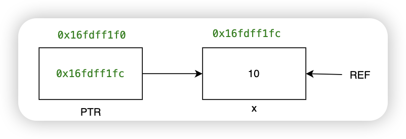

# C++基础
[TOC]
## 指针与引用
- 指针本身是变量，存放某个对象的地址
- 引用是变量的别名，不可变，必须初始化

```C++{.line-numbers}
int main(){
    int x = 10, y = 20;
    int *ptr;
    int &ref = x;//引用必须初始化
    ptr = &x;//ptr存放x的地址
    cout << "ptr的地址是 " << &ptr << endl;//0x16fdff1f0
    cout << "ptr的内容是 " << ptr << endl;//0x16fdff1fc
    cout << "x的地址是 " << &x <<endl;//0x16fdff1fc
    cout << "ptr指向的内容是 " << *ptr << endl;//10
    *ptr = 100;
    cout << "x的值为 " << x << endl;//100
    ptr = &y;
    cout << "ptr的地址是 " << &ptr << endl;//0x16fdff1f0
    cout << "ptr的内容是 " << ptr << endl;//0x16fdff1f8
    cout << "y的地址是 " << &y <<endl;//0x16fdff1f8
    cout << "ptr指向的内容是 " << *ptr << endl;//20
}
```

```C++{.line-numbers}
int main(){
    int x = 10, y = 20;
    // int &ref;报错
    int &ref = x;//引用必须初始化
    cout << "x的地址是 " << &x << endl;//0x16fdff1fc
    cout << "ref的地址是 " << &ref << endl;//0x16fdff1fc
    cout << "ref的值是 " << ref << endl;//10
    ref = y;
    cout << "x的值是 " << x << endl;//20
    //&ref = y;报错，引用的对象不可更改
}
```
用途：
- 指针： 通常用于动态内存分配、数组操作以及函数参数传递。
- 引用： 通常用于函数参数传递、操作符重载以及创建别名。

