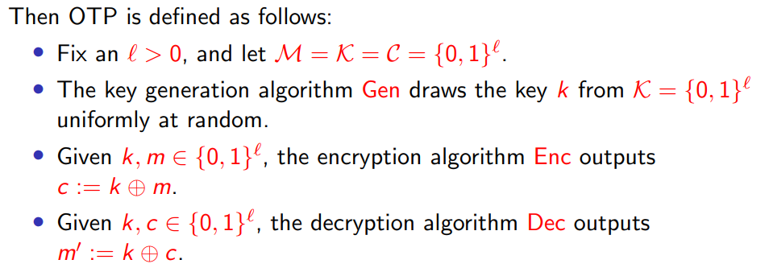

# Chapter2 Perfectly-Secret Encryption
## 本章问题
1. perfectly-secret的定义是什么？
2. 什么是一次一密OTP，OTP的性质是？
3. Perfect secrecy的局限性？

## 问题答案：
### Question 1
**Definition 1：**
$Pr[M=m|C=c] = Pr[M=m]$
**Definition 2：**
$Pr[C=c|M=m] = Pr[C=c]$
**Definition 3:**
$Pr[C=c|M=m_1]=Pr[C=c|M=m_0]$
**Definition 4:**
定义实验$PrivK^{eav}_{A,\Pi}$:
1. $A$ outputs $m_0,m_1 \in M$;
2. $k\leftarrow Gen(·)$;$b\leftarrow \{0,1\}$;$c\leftarrow Enc_k(m_b)$;
3. Given $c$, $A$ outputs $b'\in\{0,1\}$;
4. if $b=b'$,output 1, ohterwise 0;

$Pr[PrivK^{eav}_{A,\Pi}=1] = \frac{1}{2}$
**证明定义等价**
> 条件概率相关公式：
> 1. $P(B|A)=\frac{P(AB)}{P(A)}$
> 2. $P(A_1A_2\cdots A_n) = P(A_1)P(A_2|A_1)\cdots P(A_n|A_1A_2\cdots A_{n-1}) $
> 3. (全概率公式) $P(A) = \sum_{i=1}^nP(B_i)P(A|B_i)$
> 4. (贝叶斯公式) $P(B_i|A)=\frac{P(AB^{i})}{P(A)}=\frac{P(B_i)P(A|B_i)}{\sum_i P(B_i)P(A|B_i)}$

### Question 2
**Definition**

**Theorem**
OTP is perfectly-secret
 

### Question 3

