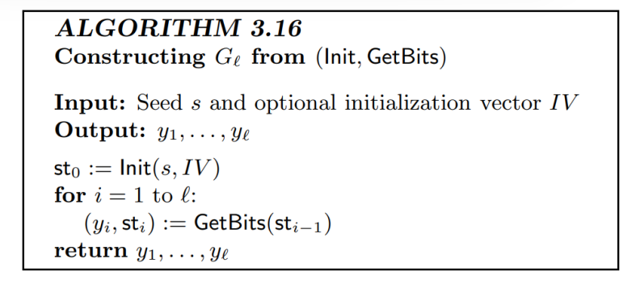

# Chapter 3 Private Key Encryption
## 本章问题
1. 什么是可忽略函数，性质是？
2. 什么是私钥加密方案？
3. 什么是不可区分性？
4. 什么是伪随机生成器？
5. 什么是流密码？
6. 由伪随机生成器得到的固定长度的加密方案是什么？
7. 什么是多消息窃听实验？
8. 什么是CPA安全性？
9. 什么是LR-Oracle？
10. 什么是伪随机函数，什么是伪随机置换？
11. 
## 问题答案
### Question 1
$f$是可忽略函数，若$\exist 多项式 p,N\in \mathbb{N},s.t.\ \forall n> N,f(n)<\frac{1}{p(n)}$
性质：
1. 可忽略函数的和是可忽略函数
2. 可忽略函数与多项式的乘积是可忽略函数
3. 
### Question 2

### Question 3
不可区分性用一个对抗性不可区分性实验定义：

**Definition 1**
$Pr[PrivK^{eav}_{A,\Pi}(n)=1]\leq \frac{1}{2+negl(n)}$
**Definition 2**
$|Pr[output(PrivK^{eav}_{A,\Pi}(n,0))=1]-Pr[output(PrivK^{eav}_{A,\Pi}(n,1))=1]|\leq negl(n)$

### Question 4

### Question 5

### Question 6

**Theorem**
上述构造具有不可区分性

### Question 7
Multiple-message eavesdropping experiment $PrivK^{\mult}_{A,\Pi}(n)$

### Question 8
CPA(Chosen Plaintext Attack)选择明文攻击：

### Question 9

