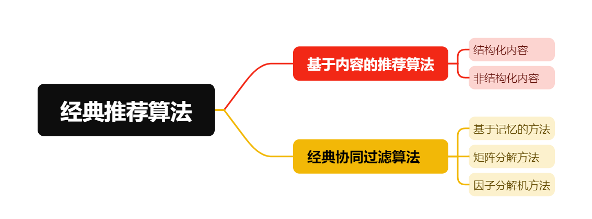
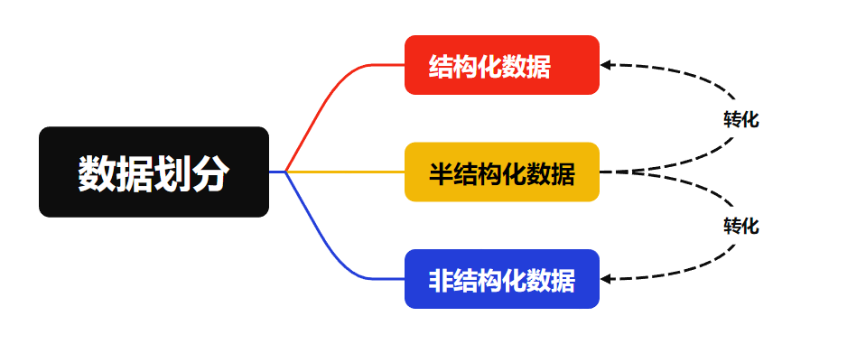
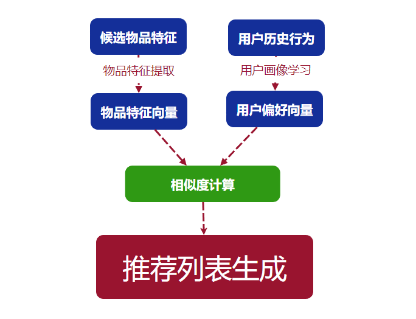
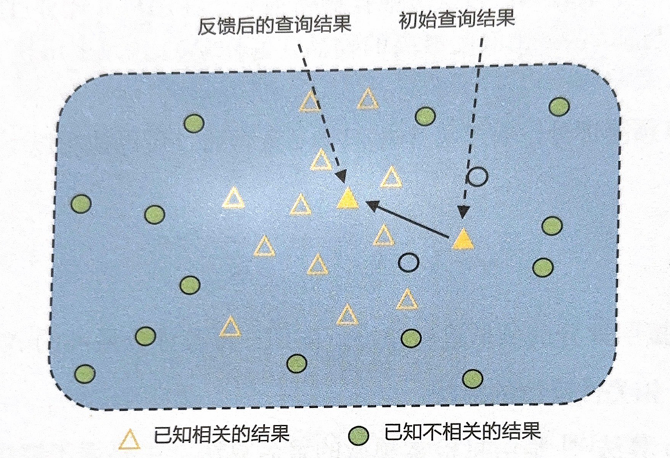

# Chapter2-经典推荐算法
本章介绍深度学习兴起之前的推荐算法，包括基于内容的推荐算法和经典协同过滤算法。

## 2.1 基于内容的推荐算法
基于内容的推荐算法一般只依赖于用户及物品自身的内容属性和行为属性，而不涉及其他用户的行为，在冷启动的情况下依然可以做出推荐。
在整个推荐过程中，可能产生数据的地方包括用户自身、用户操作行为、候选物品信息以及上下文场景等。

* 结构化数据
包括文本、数值型，一般可以用表结构存储
* 半结构化数据
包括日志类数据、用户行为类数据，对相关字段进行记录、分割、拼接，以预定义的方式进行组织，例如XML和JSON这类格式数据。
* 非结构化数据
包括音频、图片、视频等
### 2.1.1 基于结构化内容的推荐
#### 基本的基于内容的推荐算法

$F_u$表示某个用户的偏好特征，$F_i$表示某个候选物品的偏好特征；$k$表示第$k$个特征，向量中一共有$K$个特征
计算余弦相似度：
$$\cos(F_u,F_i)=\frac{F_u\cdot F_i}{|F_u|\times |F_i|}=\frac{\Sigma_{k=1}^{K}F_{uk}F_{ik}}{\sqrt{\Sigma_{k=1}^K F^2_{uk}}\sqrt{\Sigma_{k=1}^{K}}F^{2}_{ik}}$$
若余弦相似度越靠近$1$，表示越靠近用户偏好；越靠近$-1$，越不适合该用户
在计算所有候选物品与用户的相似度之后，按照相似度从高到低排序，保存$Top-K$个候选物品推荐给用户。
#### 最近邻分类算法
$K$近邻（K-Nearest Neighbor，KNN）算法的三个关键点：
1. 算法超参数$K$的选取
2. 距离或者相似度度量方法的选取
3. 分类决策的规则

算法步骤：
对于物品$m$，在用户评过分的所有物品中选取$k$个与物品$m$相似度最高的物品，然后计算物品$m$的预测评分，最后根据不同物品的预测评分按照从高到低排序后推荐给用户。
1. 计算相似度
推荐系统中常计算的相似度有：皮尔逊相似度、余弦相似度、杰卡德相似度、欧氏距离等。采用$S_{m,n}$表示物品$m$和物品$n$的相似度。
2. 选择$k$个最近邻
用$N(u,m)$表示用户$u$评分过的物品中与$m$相似度最高的$k$个物品的集合
3. 计算预测评分
得到物品$m$的预测评分：
$$\hat{r}_{u,m}=\frac{\Sigma_{n\in N(u,m)}S_{n,m}\cdot r_{u,m}}{\Sigma_{n\in N(u,m)}S_{n,m}}$$

#### 基于相关性反馈的算法

Rocchio算法主要用于解决相关性反馈问题。用Rocchio算法构建用户画像向量时，通常假设该向量与用户喜欢的物品特征之间的相关性最大且与用户不喜欢的物品特征之间的相关性最小。
算法的目标是：新的用户特征向量与用户喜欢的物品的特征向量最相似，与用户不喜欢的物品的特征向量最不同。
$I_r$和$I_{nr}$分别表示用户喜欢和不喜欢的物品集合，$w_j$表示物品$j$的特征向量。用户$u$的特征向量定义如下：
$$w_u=\frac{1}{|I_r|}\Sigma_{w_j\in I_r}w_j-\frac{1}{|I_{nr}|}\Sigma_{w_k\in I_{nr}}w_k$$
在实际应用中，目标用户的特征向量可能已经存在，这时只需更新用户的特征向量：
$$w_u=\alpha U_{0}+\beta\frac{1}{|I_r|}\Sigma_{w_j\in I_r}w_j-\gamma\frac{1}{|I_{nr}|}\Sigma_{w_k\in I_{nr}}w_k$$
$\alpha、\beta、\gamma$分别表示初始特征向量、正反馈、负反馈的权重

Rocchio算法的一个优点是可以根据用户反馈实时更新用户特征向量

#### 基于决策树的推荐
决策树相比于KNN等算法具有可解释性的优势。从算法上来说，决策树的训练是一个递归的过程，递归返回的条件为：